# ANT-X Simulation MATLAB

Questa repository ha l’obiettivo di raccogliere e documentare le prime versioni della simulazione MATLAB relative al drone UAV **ANT-X**. Si tratta di una fase iniziale del progetto, finalizzata principalmente all’organizzazione delle idee e alla definizione di un modello semplificato in grado di rappresentare le principali dinamiche del drone ANT-X [[1]](#references).

L’obiettivo principale è sviluppare, ad alto livello, l’intera **pipeline operativa** della simulazione, comprendente:

* definizione del *modello dinamico* non lineare;
* *ricostruzione* di stati e input a partire dalle *uscite piatte*;
* generazione di *traiettorie feasible*;
* costruzione offline delle *reference* tramite input PWC (Piecewise Constant);
* validazione iniziale in *open-loop*;
* implementazione del controllore *MPC*;
* raccolta e analisi dei risultati ottenuti dalle **simulazioni**.

La repository rappresenta quindi una **base di sviluppo** per l’evoluzione futura del framework di simulazione e controllo del drone **ANT-X**.

 

## Limitazioni Principali

### Modello Dinamico

- **Corpo rigido idealizzato:** I modelli implementati trascurano il drag aerodinamico, il
  blade flapping e le dinamiche dei rotori.
- **Assenza della dinamica motore/ESC:** Il modello assume attuazione istantanea.

- **Mixing non implementato:** Gli ingressi del controllore sono grandezze fisiche
  `[T, L, M, N]`; i coefficienti di thrust `C_T` e di torque `C_Q` (necessari per la
  mappatura verso i 4 segnali PWM motore) non sono noti e la matrice
  di mixing non è inclusa.

### Parametri

- **Matrici di inerzia:** I valori `Jxx`, `Jyy`, `Jzz` sono
  ereditati da una stima su drone simile e dovranno essere validati o sostituiti con
  misure sperimentali in laboratorio. [[2]](#references)
- **Saturazioni di input come stime iniziali:** I limiti `T ∈ [0, 2mg N]`, `L, M ∈ [±0.15 Nm]`,
  `N ∈ [±0.05 Nm]` sono stime preliminari.
- **Vincoli sui quaternioni nel modello a 13 stati:** I vincoli sui quaternioni sono stati omessi.

### Controllo

- **Matrici di peso `Q`, `R` e costo terminale `Qf = Q`:** Valori inizializzati e
  adattati da Kunz et al. [[3]](#references); la scelta `Qf = Q` è una semplificazione ereditata dal paper che non garantisce stabilità asintotica.

- **`quadprog` non è real-time embeddable.** Per il deployment onboard il solver QP dovrà essere sostituito con un'alternativa real-time.

### Scenario di Simulazione

- **Stato perfetto (no EKF, no rumore).** La simulazione assume disponibilità
  completa e priva di rumore dello stato del sistema. In laboratorio, lo stato
  deriverà dalla fusione IMU + motion capture tramite
  l'EKF di PX4, con rumore di misura e latenza.
- **Ground effect e decollo non modellati.** La condizione iniziale `Origin`
  posiziona il drone a terra, ma l'aumento di spinta dovuto al **ground
  effect** e la traiettoria di decollo verso la quota nominale non sono gestiti
  esplicitamente.

 

  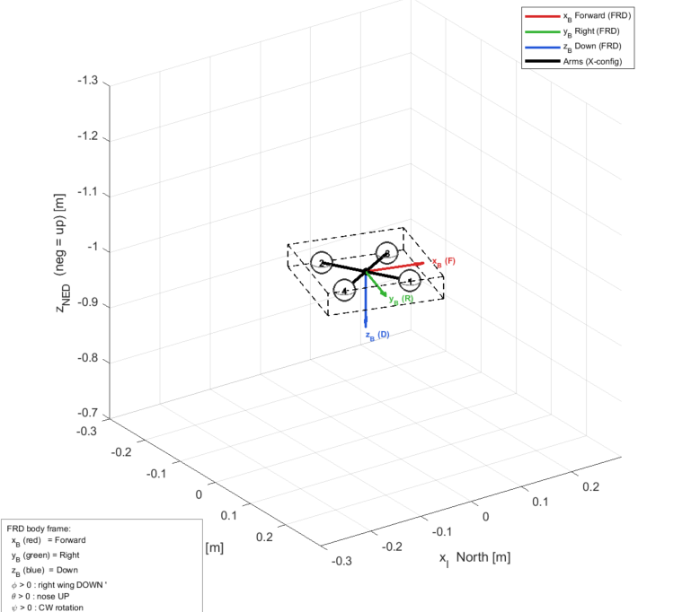
  &nbsp;&nbsp;
  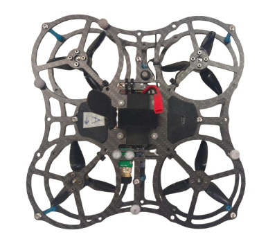

  <em>Confronto tra la ricostruzione del drone e il modello ANT-X.</em>

 

## Indice dei Contenuti

- [Utilizzo e Prerequisiti](#Utilizzo-e-Prerequisiti)
- [Modello Dinamico del Quadcopter](#Modello-Dinamico-Del-Quadcopter)
    - [Derivazione](#Derivazione)
    - [Modello Dinamico a 13 stati](#Modello-Dinamico-a-13-stati)
    - [Parametri](#Parametri)
    - [Linearizzazione](#Linearizzazione)
- [Flatness Map](#Flatness-Map)
    - [State Reconstruction](#State-Reconstruction)
    - [Input Reconstruction](#Input-Reconstruction)
- [Traiettorie](#Traiettorie)
    - [Test sui gradi di libertà (DoF)](#Test-sui-gradi-di-libertà-(DoF))
    - [Traiettorie complesse](#Traiettorie-complesse)
- [Open-Loop Test](#Open-Loop-Test)
    - [Open-Loop Continuous reference vs PWC inputs generated reference](#Open-Loop-Continuous-reference-vs-PWC-inputs-generated-reference)
- [Implementazione MPC](#implementazione-mpc)
    - [Parametri di Controllo](#Parametri-di-Controllo)
    - [Costruzione del problema QP](#Costruzione-del-problema-QP)
    - [Warm Start](#Warm-Start)
- [Simulazione in Closed-Loop](#simulazione-in-closed-loop)
    - [Traiettorie testate](#traiettorie-testate)
    - [Condizioni iniziali](#Condizioni-iniziali)
    - [Metriche di valutazione](#Metriche-di-valutazione)
    - [Output della simulazione](#output-della-simulazione)
- [Risultati](#Risultati)
    - [Tracking MPC](#Tracking-MPC)
    - [Tracking dello stato](#Tracking-dello-stato)
    - [Analisi del Tracking](#Analisi-del-Tracking)
    - [Tracking degli input](#Tracking-degli-input)
    - [Risultati Quantitativi](#Risultati-Quantitativi)
- [Implementazioni Future e Conclusioni](#Implementazioni-Future-e-Conclusioni)
- [References](#references)

 

## Utilizzo e Prerequisiti

Per eseguire le simulazioni e ispezionare il codice è necessario disporre di una versione aggiornata di `MATLAB` con le librerie principali richieste dal progetto, in particolare:

* `ode45` per l’integrazione numerica del modello dinamico non-lineare;
* `Optimization Toolbox` per l’utilizzo del risolutore `quadprog`, impiegato nell’implementazione del controllore MPC.

Le simulazioni disponibili sono contenute nella directory `scripts/` e comprendono le seguenti categorie:

* **Simulazione Open-Loop di base:**
  Utilizzata per validare i principali gradi di libertà del drone, analizzando separatamente le dinamiche di Roll, Pitch, Thrust e Yaw.

* **Simulazioni Open-Loop su traiettorie complesse:**
  Finalizzate alla validazione di traiettorie generate tramite differential flatness, tra cui Circle, Lemniscate e Spiral, integrando il modello dinamico con input campionati.

* **Confronto tra traiettorie continue e input PWC:**
  Simulazione dedicata al confronto tra traiettorie continue ideali e traiettorie ottenute tramite integrazione di input Piecewise Constant (PWC).

* **Simulazioni Closed-Loop con MPC**
  Test del controllore **Model Predictive Control (MPC)** su diverse condizioni iniziali e su differenti traiettorie di riferimento.

 

## Modello Dinamico del Quadcopter

Il framework utilizza un modello dinamico non lineare semplificato del quadcopter, implementato nella classe `A00_SimplifiedModel.m`.
Il modello descrive la dinamica rigida del drone tramite le equazioni di Newton-Eulero, assumendo il velivolo come corpo rigido e trascurando, in questa prima fase, effetti aerodinamici avanzati, dinamiche dei motori e disturbi esterni.

La formulazione adottata utilizza:

* un sistema di riferimento inerziale **NED** (*North-East-Down*);
* un sistema di riferimento body **FRD** (*Forward-Right-Down*);
* velocità lineari espresse nel body frame;
* orientazione descritta tramite angoli di Eulero **Z-Y-X**.

Lo **stato** del sistema è definito da:

$$ [x_I, y_I, z_I, \dot x_B, \dot y_B, \dot z_B, \phi, \theta, \psi, p, q, r ] \in \mathbb{R}^{12} $$

dove:

* $p_I = (x_I, y_I, z_I)$ rappresentano le posizioni nel frame inerziale in $[m]$;
* $v_B = (\dot x_B, \dot y_B, \dot z_B)$ sono le velocità lineari nel body frame in $[m/s]$;
* $\alpha = (\phi, \theta, \psi)$ corrispondono agli angoli di assetto (Roll, Pitch, Yaw) in $[rad]$;
* $\omega_B = (p, q, r)$ sono le velocità angolari del corpo rigido in $[rad/s]$.

Gli **ingressi** del modello corrispondono invece a:

$$ [T, L, M, N] \in \mathbb{R}^4$$

dove:

* $T$ corrisponde al thrust collettivo $[N]$;
* $L$ corrisponde al momento di Roll $[Nm]$;
* $M$ corrisponde al momento di Pitch $[Nm]$;
* $N$ corrisponde al momento di Yaw $[Nm]$.

 

> **Nota:** In questa prima implementazione, gli ingressi del modello rappresentano direttamente grandezze fisiche non normalizzate. In particolare, il thrust collettivo agisce lungo l’asse $z_B$ del body frame, mentre le coppie $L$, $M$ e $N$ influenzano rispettivamente le dinamiche di Roll, Pitch e Yaw attraverso i body rates $p$, $q$ e $r$.

### Derivazione

---

La funzione `dynamics()` implementa direttamente il sistema di **ODE** che descrive l’evoluzione temporale dello stato ed è composto da 4 blocchi:

* cinematica della posizione;
* dinamica traslazionale;
* cinematica rotazionale;
* dinamica rotazionale.

 

$$\begin{cases}

\dot{x}_I =
\dot x_B(\cos\theta\cos\psi)\,
+
\dot y_B(\sin\phi\sin\theta\cos\psi - \cos\phi\sin\psi)\,
+
\dot z_B (\cos\phi\sin\theta\cos\psi + \sin\phi\sin\psi)\,
\\[0.8em]

\dot{y}_I =
\dot x_B(\cos\theta\sin\psi)\,
+
\dot y_B (\sin\phi\sin\theta\sin\psi + \cos\phi\cos\psi)\,
+
\dot z_B (\cos\phi\sin\theta\sin\psi - \sin\phi\cos\psi)\,
\\[0.8em]

\dot{z}_I =
-\dot x_B\sin\theta\,
+
\dot y_B\sin\phi\cos\theta\,
+
\dot z_B\cos\phi\cos\theta\,
\\[0.8em]

\ddot{x}_B =
r\,\dot y_B - q\,\dot z_B - g\sin\theta
\\[0.8em]

\ddot{y}_B =
p\,\dot z_B - r\,\dot x_B + g\sin\phi\cos\theta
\\[0.8em]

\ddot{z}_B =
q\,\dot x_B - p\,\dot y_B + g\cos\phi\cos\theta - \frac{T}{m}
\\[0.8em]

\dot{\phi} =
p + \sin\phi\tan\theta\,q + \cos\phi\tan\theta\,r
\\[0.8em]

\dot{\theta} =
\cos\phi\,q - \sin\phi\,r
\\[0.8em]

\dot{\psi} =
\frac{\sin\phi}{\cos\theta}\,q
+
\frac{\cos\phi}{\cos\theta}\,r
\\[0.8em]

\dot{p} =
\frac{1}{J_{xx}}
\left(
L - (J_{zz}-J_{yy})qr
\right)
\\[0.8em]

\dot{q} =
\frac{1}{J_{yy}}
\left(
M - (J_{xx}-J_{zz})pr
\right)
\\[0.8em]

\dot{r} =
\frac{1}{J_{zz}}
\left(
N - (J_{yy}-J_{xx})pq
\right)

\end{cases}$$

 

#### Cinematica della Posizione

Le velocità lineari del drone vengono espresse nel body frame:

$$
v_B =
\begin{bmatrix}
\dot x_B \\
\dot y_B \\
\dot z_B
\end{bmatrix}
$$

mentre la posizione nel frame inerziale è definita come:

$$
p_I =
\begin{bmatrix}
x_I \\
y_I \\
z_I
\end{bmatrix}
$$

Applicando la sequenza di rotazioni Z-Y-X, attraverso le matrici:

$$
R_z(\psi)=
\begin{bmatrix}
\cos\psi & -\sin\psi & 0 \\
\sin\psi & \cos\psi & 0 \\
0 & 0 & 1
\end{bmatrix}
$$

$$
R_y(\theta)=
\begin{bmatrix}
\cos\theta & 0 & \sin\theta \\
0 & 1 & 0 \\
-\sin\theta & 0 & \cos\theta
\end{bmatrix}
$$

$$
R_x(\phi)=
\begin{bmatrix}
1 & 0 & 0 \\
0 & \cos\phi & -\sin\phi \\
0 & \sin\phi & \cos\phi
\end{bmatrix}
$$

otteniamo la seguente equivalenza:

$$ R(\phi,\theta,\psi) = R_z(\psi)R_y(\theta)R_x(\phi)
$$

$$
R(\phi,\theta,\psi)=
\begin{bmatrix}

\cos\theta\cos\psi &
\sin\phi\sin\theta\cos\psi-\cos\phi\sin\psi &
\cos\phi\sin\theta\cos\psi+\sin\phi\sin\psi \\

\cos\theta\sin\psi &
\sin\phi\sin\theta\sin\psi+\cos\phi\cos\psi &
\cos\phi\sin\theta\sin\psi-\sin\phi\cos\psi \\

-\sin\theta &
\sin\phi\cos\theta &
\cos\phi\cos\theta

\end{bmatrix}
$$

La derivata della posizione nel frame inerziale è quindi:

$$
\dot{p}_I = R(\phi,\theta,\psi) \ v_B
$$

Esplicitando le tre equazioni si ottiene:

$$
\begin{cases}
\dot{x}_I =
\dot x_B(\cos\theta\cos\psi)\,
+
\dot y_B(\sin\phi\sin\theta\cos\psi - \cos\phi\sin\psi)\,
+
\dot z_B (\cos\phi\sin\theta\cos\psi + \sin\phi\sin\psi)\, \\

\dot{y}_I =
\dot x_B(\cos\theta\sin\psi)\,
+
\dot y_B (\sin\phi\sin\theta\sin\psi + \cos\phi\cos\psi)\,
+
\dot z_B (\cos\phi\sin\theta\sin\psi - \sin\phi\cos\psi)\, \\

\dot{z}_I =
-\dot x_B\sin\theta\,
+
\dot y_B\sin\phi\cos\theta\,
+
\dot z_B\cos\phi\cos\theta\,
\end{cases}
$$

 

#### Dinamica Traslazionale

La dinamica traslazionale descrive come variano le velocità lineari del quadcopter espresse nel sistema di riferimento Body Frame (FRD):

$$ v_B = \begin{bmatrix} \dot{x}_B \\ \dot{y}_B \\ \dot{z}_B \end{bmatrix} $$

Partendo dalla seconda legge di Newton: 

$$ m \mathbf{a}_I = \mathbf{F}_I $$

 La derivata temporale della velocità inerziale è:

$$ \mathbf{a}_I = \frac{d}{dt} \mathbf{v}_I = \frac{d}{dt} (\mathbf{R} \mathbf{v}_B) = \mathbf{R} \dot{\mathbf{v}}_B + \dot{\mathbf{R}} \mathbf{v}_B $$

Sfruttando la proprietà cinematica della derivata della matrice di rotazione $\dot{\mathbf{R}} = \mathbf{R} \mathbf{S}(\boldsymbol{\omega}_B)$, dove $\mathbf{S}(\boldsymbol{\omega}_B)$ è la matrice antisimmetrica associata alla velocità angolare del corpo $\boldsymbol{\omega}_B = [p, q, r]^T$, si ottiene:

$$ \mathbf{a}_I = \mathbf{R} \left( \dot{\mathbf{v}}_B + \boldsymbol{\omega}_B \times \mathbf{v}_B \right) $$

Sostituendo questa espressione nella legge di Newton e proiettando tutte le forze sul Body frame ($\mathbf{F}_B = \mathbf{R}^T \mathbf{F}_I$), otteniamo l'equazione fondamentale della dinamica traslazionale in coordinate solidali al corpo:

$$ m \left( \dot{\mathbf{v}}_B + \boldsymbol{\omega}_B \times \mathbf{v}_B \right) = \mathbf{F}_B $$

Sul quadcopter agiscono principalmente due forze esterne: la **gravità** e la spinta collettiva generata dai rotori.

* **Forza di Gravità ($\mathbf{F}_{g,B}$):**
La forza di gravità nel sistema inerziale (NED) è diretta esclusivamente lungo l'asse $z_I$:

$$ \mathbf{F}_{g,I} = \begin{bmatrix} 0 \\ 0 \\ m g \end{bmatrix} $$

Proiettando questa forza nel Body frame tramite la trasposta della matrice di rotazione $\mathbf{R}^T$:

$$ \mathbf{F}_{g,B} = \mathbf{R}^T \begin{bmatrix} 0 \\ 0 \\ m g \end{bmatrix} = m g \begin{bmatrix} -\sin\theta \\ \sin\phi \cos\theta \\ \cos\phi \cos\theta \end{bmatrix} $$

* **Spinta dei motori**: ($\mathbf{F}_{T,B}$)
I motori generano una spinta collettiva totale $T$ diretta lungo l'asse verticale del corpo, ma diretta verso l'alto (direzione $-z_B$ nel sistema di riferimento Down):

$$ \mathbf{F}_{T,B} = \begin{bmatrix} 0 \\ 0 \\ -T \end{bmatrix} $$

* **Forza totale ($\mathbf{F}_B$)**:
Sommando i contributi della gravità e della spinta si ottiene:

$$ \mathbf{F}_B = \mathbf{F}_{g,B} + \mathbf{F}_{T,B} = \begin{bmatrix} -m g \sin\theta \\ m g \sin\phi \cos\theta \\ m g \cos\phi \cos\theta - T \end{bmatrix} $$

Sviluppando il termine cinematico legato al prodotto vettoriale della velocità angolare $\boldsymbol{\omega}_B = [p, q, r]^T$ e della velocità lineare $\mathbf{v}_B = [\dot{x}_B, \dot{y}_B, \dot{z}_B]^T$:

$$ \boldsymbol{\omega}_B \times \mathbf{v}_B = \begin{bmatrix} p \\ q \\ r \end{bmatrix} \times \begin{bmatrix} \dot{x}_B \\ \dot{y}_B \\ \dot{z}_B \end{bmatrix} = \begin{bmatrix} q \dot{z}_B - r \dot{y}_B \\ r \dot{x}_B - p \dot{z}_B \\ p \dot{y}_B - q \dot{x}_B \end{bmatrix} $$

Sostituendo questa relazione nell'equazione di Newton-Euler:

$$ m \left( \begin{bmatrix} \ddot{x}_B \\ \ddot{y}_B \\ \ddot{z}_B \end{bmatrix} + \begin{bmatrix} q \dot{z}_B - r \dot{y}_B \\ r \dot{x}_B - p \dot{z}_B \\ p \dot{y}_B - q \dot{x}_B \end{bmatrix} \right) = \begin{bmatrix} -m g \sin\theta \\ m g \sin\phi \cos\theta \\ m g \cos\phi \cos\theta - T \end{bmatrix} $$

Dividendo per la massa $m$ ed isolando le accelerazioni $\ddot{x}_B, \ddot{y}_B, \ddot{z}_B$ (che rappresentano la variazione temporale delle velocità nel Body frame $\dot{\mathbf{v}}_B$), si ottiene il set di equazioni relative al blocco della **Dinamica Traslazionale**:

$$\begin{cases}
 \ddot{x}_B = r \dot{y}_B - q \dot{z}_B - g \sin\theta \\

\ddot{y}_B = p \dot{z}_B - r \dot{x}_B + g \sin\phi \cos\theta \\

 \ddot{z}_B = q \dot{x}_B - p \dot{y}_B + g \cos\phi \cos\theta - \frac{T}{m} 

\end{cases}$$

 

#### Cinematica Rotazionale

La cinematica rotazionale descrive la relazione tra i body rates del quadcopter:

$$
\omega_B =
\begin{bmatrix}
p \\
q \\
r
\end{bmatrix}
$$

e la variazione temporale degli angoli di Eulero:

$$
\alpha =
\begin{bmatrix}
\phi \\
\theta \\
\psi
\end{bmatrix}
$$

La relazione cinematica è definita da:

$$
\dot{\alpha} = E^{-1}(\phi,\theta)\,\omega_B
$$

dove:

$$
E^{-1}(\phi,\theta)=
\begin{bmatrix}
1 & \sin\phi\tan\theta & \cos\phi\tan\theta \\
0 & \cos\phi & -\sin\phi \\
0 & \frac{\sin\phi}{\cos\theta} & \frac{\cos\phi}{\cos\theta}
\end{bmatrix}
$$

Esplicitando le tre equazioni:

$$
\begin{cases}

\dot{\phi} =
p + \sin\phi\tan\theta\,q + \cos\phi\tan\theta\,r
\\[0.8em]

\dot{\theta} =
\cos\phi\,q - \sin\phi\,r
\\[0.8em]

\dot{\psi} =
\frac{\sin\phi}{\cos\theta}\,q
+
\frac{\cos\phi}{\cos\theta}\,r

\end{cases}
$$

> **Nota**: La parametrizzazione tramite angoli di Eulero utilizzata nel modello a 12 stati introduce una singolarità per $\theta = \pm 90^\circ$, nota come **Gimbal Lock**. Per evitare questo problema è possibile impiegare un modello a 13 stati basato sui *quaternioni*, che consente una rappresentazione dell'assetto priva di singolarità.

 

#### Dinamica Rotazionale

La dinamica rotazionale descrive l’evoluzione temporale delle velocità angolari del quadcopter nel body frame.

Definendo la matrice di inerzia:

$$
J =
\begin{bmatrix}
J_{xx} & 0 & 0 \\
0 & J_{yy} & 0 \\
0 & 0 & J_{zz}
\end{bmatrix}
$$

le equazioni di Eulero per un corpo rigido assumono la forma:

$$
J\dot{\omega}_B + \omega_B \times (J\omega_B) = \tau_B
$$

dove:

$$
\tau_B =
\begin{bmatrix}
L \\
M \\
N
\end{bmatrix}
$$

rappresenta il vettore delle coppie applicate al drone.

Esplicitando le tre equazioni dinamiche si ottiene:

$$
\begin{cases}

\dot{p} =
\frac{1}{J_{xx}}
\left(
L - (J_{zz}-J_{yy})qr
\right)
\\[0.8em]

\dot{q} =
\frac{1}{J_{yy}}
\left(
M - (J_{xx}-J_{zz})pr
\right)
\\[0.8em]

\dot{r} =
\frac{1}{J_{zz}}
\left(
N - (J_{yy}-J_{xx})pq
\right)

\end{cases}
$$

 

### Modello Dinamico a 13 stati

---

Il modello dinamico a 13 stati, implementato nella classe `A01_SimplifiedModel_quat.m`, assume la seguente dinamica:

$$
\begin{cases}
\dot{x}_I = (q_0^2 + q_1^2 - q_2^2 - q_3^2)\dot{x}_B + 2(q_1 q_2 - q_0 q_3)\dot{y}_B + 2(q_1 q_3 + q_0 q_2)\dot{z}_B \\
\dot{y}_I = 2(q_1 q_2 + q_0 q_3)\dot{x}_B + (q_0^2 - q_1^2 + q_2^2 - q_3^2)\dot{y}_B + 2(q_2 q_3 - q_0 q_1)\dot{z}_B \\
\dot{z}_I = 2(q_1 q_3 - q_0 q_2)\dot{x}_B + 2(q_2 q_3 + q_0 q_1)\dot{y}_B + (q_0^2 - q_1^2 - q_2^2 + q_3^2)\dot{z}_B \\
\ddot{x}_B = r \dot{y}_B - q_r \dot{z}_B + 2g(q_1 q_3 - q_0 q_2) \\
\ddot{y}_B = p \dot{z}_B - r \dot{x}_B + 2g(q_2 q_3 + q_0 q_1) \\
\ddot{z}_B = q_r \dot{x}_B - p \dot{y}_B + g(q_0^2 - q_1^2 - q_2^2 + q_3^2) - \frac{T}{m} \\
\dot{q}_0 = -\frac{1}{2}(q_1 p + q_2 q_r + q_3 r) \\
\dot{q}_1 = \frac{1}{2}(q_0 p + q_2 r - q_3 q_r) \\
\dot{q}_2 = \frac{1}{2}(q_0 q_r + q_3 p - q_1 r) \\
\dot{q}_3 = \frac{1}{2}(q_0 r + q_1 q_r - q_2 p) \\
\dot{p} = \frac{1}{J_{xx}}\left(L - (J_{zz} - J_{yy})q_r r\right) \\
\dot{q}_r = \frac{1}{J_{yy}}\left(M - (J_{xx} - J_{zz})p r\right) \\
\dot{r} = \frac{1}{J_{zz}}\left(N - (J_{yy} - J_{xx})p q_r\right)
\end{cases}
$$

 

Il blocco relativo alla cinematica della posizione è stato ottenuto sfruttando la relazione tra la velocità espressa nel body frame e la velocità nel sistema inerziale:

$$
\dot{\mathbf{p}}_I = \mathbf{R}(\mathbf{q}) \, \mathbf{v}_B
$$

dove $\mathbf{R}(\mathbf{q}) \in \mathbb{R}^{3\times3}$ è la matrice di rotazione associata al quaternione unitario $\mathbf{q}$, definito come:

$$
\mathbf{q} =
\begin{bmatrix}
q_0 \\
q_1 \\
q_2 \\
q_3
\end{bmatrix}
=
\begin{bmatrix}
q_0 \\
\mathbf{q}_v
\end{bmatrix},
\qquad
\mathbf{q}_v =
\begin{bmatrix}
q_1 \\
q_2 \\
q_3
\end{bmatrix},
$$

dove $q_0$ rappresenta la parte scalare e $\mathbf{q}_v$ la parte vettoriale del quaternione.

La matrice di rotazione associata al quaternione è data da:

$$
\mathbf{R}(\mathbf{q})
=
\left(q_0^2 - \|\mathbf{q}_v\|^2\right)\mathbf{I}_3
+
2\,\mathbf{q}_v \mathbf{q}_v^\top
+
2 q_0 \mathbf{S}(\mathbf{q}_v),
$$

$$\mathbf{R}(\mathbf{q}) = \begin{bmatrix}
q_0^2 + q_1^2 - q_2^2 - q_3^2 & 2(q_1 q_2 - q_0 q_3) & 2(q_1 q_3 + q_0 q_2) \\
2(q_1 q_2 + q_0 q_3) & q_0^2 - q_1^2 + q_2^2 - q_3^2 & 2(q_2 q_3 - q_0 q_1) \\
2(q_1 q_3 - q_0 q_2) & 2(q_2 q_3 + q_0 q_1) & q_0^2 - q_1^2 - q_2^2 + q_3^2
\end{bmatrix}$$

dove $\mathbf{S}(\mathbf{q}_v)$ è la matrice antisimmetrica associata al prodotto vettoriale:

$$
\mathbf{S}(\mathbf{q}_v)
=
\begin{bmatrix}
0      & -q_3 & q_2 \\
q_3    & 0    & -q_1 \\
-q_2   & q_1  & 0
\end{bmatrix}.
$$

Il blocco relativo alla dinamica traslazionale è stato ricavato a partire dalla seguente equazione del moto espressa nel body frame:

$$
\mathbf{a}_B
=
-\boldsymbol{\omega}_B \times \mathbf{v}_B
+
\mathbf{g}_B
+
\frac{1}{m}\mathbf{F}_{T,B},
$$

dove $ \mathbf{g}_B$ rappresenta il vettore gravitazionale espresso nel body frame.

Sviluppando l'espressione precedente si ottiene:

$$
\begin{bmatrix}
\ddot{x}_B \\
\ddot{y}_B \\
\ddot{z}_B
\end{bmatrix}
=
\begin{bmatrix}
q \dot{z}_B - r \dot{y}_B \\
r \dot{x}_B - p \dot{z}_B \\
p \dot{y}_B - q \dot{x}_B
\end{bmatrix}
+
\begin{bmatrix}
g_B^{(1)} \\
g_B^{(2)} \\
g_B^{(3)}
\end{bmatrix}
+
\begin{bmatrix}
0 \\
0 \\
-\dfrac{T}{m}
\end{bmatrix}.
$$

Il vettore gravitazionale nel sistema di riferimento del corpo è definito come

$$
\mathbf{g}_B
=
\begin{bmatrix}
g_B^{(1)} \\
g_B^{(2)} \\
g_B^{(3)}
\end{bmatrix}
=
\mathbf{R}(\mathbf{q})^\top
\begin{bmatrix}
0 \\
0 \\
g
\end{bmatrix},
$$

Le quantità $g_B^{(1)}$, $g_B^{(2)}$ e $g_B^{(3)}$ rappresentano le componenti del vettore gravitazionale proiettato nel body frame.

Infine, l'evoluzione temporale dell'assetto è descritta mediante quaternioni unitari. Sfruttando il **prodotto di Hamilton** tra il quaternione di orientamento e la velocità angolare espressa nel body frame, si ottiene:

$$
\frac{d}{dt}
\begin{bmatrix}
q_0 \\
q_1 \\
q_2 \\
q_3
\end{bmatrix}
=
\frac{1}{2}
\begin{bmatrix}
0 & p & q & r \\
-p & 0 & -r & q \\
-q & r & 0 & -p \\
-r & -q & p & 0
\end{bmatrix}
\begin{bmatrix}
q_0 \\
q_1 \\
q_2 \\
q_3
\end{bmatrix}.
$$

Il blocco relativo alla dinamica rotazionale, rimane coerente con quello adottato dal modello a 12 stati.

 

### Parametri

---

In questa prima implementazione il modello assume $m = 0.270 \ \text{kg}$ come massa complessiva del drone, mentre il braccio tra il centro del frame ed ogni motore è pari a $ b = 0.08 \ \text{m}$. [[4]](#references)

La configurazione adottata è di tipo **X**, con coppie di motori opposti aventi lo stesso verso di rotazione:

* motori $1$ e $2$: rotazione antioraria;
* motori $3$ e $4$: rotazione oraria.

Le dimensioni del frame sono: $20 \times 20 \times 4 \ \text{cm}$.

La matrice di inerzia del corpo rigido viene assunta diagonale:

$$
J =
\operatorname{diag}(J_{xx}, J_{yy}, J_{zz})
$$

con valori:

$$
J =
\operatorname{diag}
\left(
0.00307,\;
0.00307,\;
0.00239
\right)
\ \text{kg}\,\text{m}^2
$$

I parametri inerziali utilizzati nel modello sono stati ricavati da [[2]](#references).

 

### Linearizzazione

---

Il modello dinamico non lineare viene linearizzato attorno ad un generico vettore operativo nella funzione `[A, B] = get_jacobians(x_lin, u_lin)`:

$$
(x_{lin}, u_{lin})
$$

Il sistema non lineare:

$$
\dot{x} = f(x,u)
$$

viene approssimato localmente tramite il modello linearizzato:

$$
\delta \dot{x} = A \delta x + B \delta u
$$

dove:

$$
A =
\left.
\frac{\partial f(x,u)}{\partial x}
\right|_{(x_{lin},u_{lin})}
$$

$$
B =
\left.
\frac{\partial f(x,u)}{\partial u}
\right|_{(x_{lin},u_{lin})}
$$

 

**Jacobiana rispetto agli stati**

La matrice:

$$
A \in \mathbb{R}^{12 \times 12}
$$

è composta dalle derivate parziali:

$$
A_{ij} =
\frac{\partial \dot{x}_i}{\partial x_j}
$$

In forma compatta:

$$
A_{lin} =
\begin{bmatrix}

\frac{\partial \dot p_I}{\partial p_I} &
\frac{\partial \dot p_I}{\partial v_B} &
\frac{\partial \dot p_I}{\partial \alpha} &
\frac{\partial \dot p_I}{\partial \omega_B}

\\[0.8em]

\frac{\partial \dot v_B}{\partial p_I} &
\frac{\partial \dot v_B}{\partial v_B} &
\frac{\partial \dot v_B}{\partial \alpha} &
\frac{\partial \dot v_B}{\partial \omega_B}

\\[0.8em]

\frac{\partial \dot \alpha}{\partial p_I} &
\frac{\partial \dot \alpha}{\partial v_B} &
\frac{\partial \dot \alpha}{\partial \alpha} &
\frac{\partial \dot \alpha}{\partial \omega_B}

\\[0.8em]

\frac{\partial \dot \omega_B}{\partial p_I} &
\frac{\partial \dot \omega_B}{\partial v_B} &
\frac{\partial \dot \omega_B}{\partial \eta} &
\frac{\partial \dot \omega_B}{\partial \omega_B}

\end{bmatrix}
$$

dove:

$$
p_I =
\begin{bmatrix}
x_I & y_I & z_I
\end{bmatrix}^T
$$

$$
v_B =
\begin{bmatrix}
\dot x_B & \dot y_B & \dot z_B
\end{bmatrix}^T
$$

$$
\alpha =
\begin{bmatrix}
\phi & \theta & \psi
\end{bmatrix}^T
$$

$$
\omega_B =
\begin{bmatrix}
p & q & r
\end{bmatrix}^T
$$

 

**Jacobiana rispetto agli input**

La matrice jacobiana degli input: $$ B \in \mathbb{R}^{12 \times 4} $$ è definita come: $$ B_{ij} = \frac{\partial \dot{x}_i}{\partial u_j} $$ 
Nel modello considerato, la matrice linearizzata rispetto agli input assume la forma: $$ B_{lin} = \begin{bmatrix} 0 & 0 & 0 & 0 \\ 0 & 0 & 0 & 0 \\ 0 & 0 & 0 & 0 \\ 0 & 0 & 0 & 0 \\ 0 & 0 & 0 & 0 \\ -\frac{1}{m} & 0 & 0 & 0 \\ 0 & 0 & 0 & 0 \\ 0 & 0 & 0 & 0 \\ 0 & 0 & 0 & 0 \\ 0 & \frac{1}{J_{xx}} & 0 & 0 \\ 0 & 0 & \frac{1}{J_{yy}} & 0 \\ 0 & 0 & 0 & \frac{1}{J_{zz}} \end{bmatrix} $$ Le componenti non nulle della Jacobiana sono quindi: $$ \frac{\partial \ddot z_B}{\partial T} = -\frac{1}{m} $$ $$ \frac{\partial \dot p}{\partial L} = \frac{1}{J_{xx}} $$ $$ \frac{\partial \dot q}{\partial M} = \frac{1}{J_{yy}} $$ $$ \frac{\partial \dot r}{\partial N} = \frac{1}{J_{zz}} $$

Le analoghe considerazioni sulla linearizzazione, valgono anche per il modello descritto dai quaternioni a 13 stati.

 

## Flatness Map

Il quadcopter considerato appartiene alla classe dei sistemi **differenzialmente piatti**. [[5]](#references) Una possibile scelta delle uscite piatte è costituita da:

$$
\sigma =
\begin{bmatrix}
x_I \\
y_I \\
z_I \\
\psi
\end{bmatrix}
$$

dove le prime tre componenti rappresentano la posizione del drone nel sistema di riferimento inerziale, mentre $\psi$ identifica l'angolo di yaw.

> La proprietà di **differential flatness** garantisce che l'intero stato del sistema e gli input possano essere espressi in forma algebrica come funzione delle uscite piatte e di un numero finito delle loro derivate temporali, senza la necessità di integrare il modello dinamico. [[6]](#references)

In particolare, esistono delle mappe tali che:

$$
x = h \left(
\sigma,
\dot{\sigma},
\ddot{\sigma},
\sigma^{(3)}
\right)
$$

$$
u = i \left(
\sigma,
\dot{\sigma},
\ddot{\sigma},
\sigma^{(3)},
\sigma^{(4)}
\right)
$$

dove:

* $\sigma^{(3)}$ rappresenta il **jerk**, ovvero la terza derivata temporale della traiettoria;
* $\sigma^{(4)}$ rappresenta lo **snap**, ovvero la quarta derivata temporale della traiettoria.

La formulazione adottata in questo progetto segue la teoria della differential flatness applicata ai quadrotori riportata in [[5]](#references)[[7]](#references).

 

### State Reconstruction

---

Per quanto riguarda le posizioni nel sistema di riferimento inerziale, le prime tre uscite piatte coincidono direttamente con gli stati di posizione del modello:

>$$
p_I =
\begin{bmatrix}
x_I\\
y_I\\
z_I
\end{bmatrix}
=
\sigma_{1:3}.
$$

Analogamente, la velocità nel frame inerziale è ottenuta dalla prima derivata delle uscite piatte:

$$
v_I =
\begin{bmatrix}
\dot{x}_I\\
\dot{y}_I\\
\dot{z}_I
\end{bmatrix}
=
\dot{\sigma}_{1:3}.
$$

Per ricostruire le velocità espresse nel body frame è necessario determinare l'assetto del velivolo, ovvero la matrice di rotazione $R$ che descrive l'orientazione del body frame rispetto al sistema di riferimento inerziale.

A partire dall'uscita piatta associata allo yaw viene definito il vettore di heading orizzontale:

$$
x_C =
\begin{bmatrix}
\cos\psi\\
\sin\psi\\
0
\end{bmatrix}.
$$

La direzione dell'asse verticale del drone viene invece ricavata dalla forza netta richiesta dalla traiettoria. Applicando la seconda legge di Newton nel sistema inerziale:

$$
m a_I = mg\,e_z + R
\begin{bmatrix}
0\\
0\\
-T
\end{bmatrix}
$$

si definisce il vettore:

$$
F_{net}
=
m(a_I-ge_z)
$$

con

$$
e_z=
\begin{bmatrix}
0\\
0\\
1
\end{bmatrix}.
$$

La norma di tale vettore corrisponde al thrust richiesto:

$$
T = \|F_{net}\|
$$

mentre la direzione dell'asse $z_B$ nel frame inerziale è:

$$
z_B =
-\frac{F_{net}}
{\|F_{net}\|}.
$$

Una volta noti $x_C$ e $z_B$, gli altri assi del body frame vengono ricostruiti:

$$
y_B =
\frac{z_B \times x_C}
{\|z_B \times x_C\|}
$$

$$
x_B = y_B \times z_B.
$$

La matrice di rotazione è quindi ottenuta concatenando i tre termini del body frame:

$$
R =
\begin{bmatrix}
x_B & y_B & z_B
\end{bmatrix}.
$$

Dalla matrice $R$ è possibile ricavare gli angoli di Eulero secondo la convenzione Z-Y-X:

>$$
\phi = \operatorname{atan2}(R_{32},R_{33})
$$

>$$
\theta = \arcsin(-R_{31})
$$

>$$
\psi = \operatorname{atan2}(R_{21},R_{11}).
$$

Per la versione a 13 stati del modello, viene usato il **metodo di Shepperd** per garantire stabilià numerica e ricostruire l'assetto in forma di quaternioni $q = [q_0, q_1, q_2, q_3]$ direttamente dalla matrice di rotazione $R$.

Le velocità lineari nel body frame sono ottenute mediante la trasformazione:

>$$
v_B = R^T v_I.
$$

Per la ricostruzione delle velocità angolari è necessario derivare temporalmente la matrice di rotazione $R$. Tale operazione richiede la conoscenza del **jerk** della traiettoria.

Dalla dinamica traslazionale del quadcopter si definisce il vettore di forza netta:

$$
F_{net}=m(a_I-ge_z).
$$

La sua derivata temporale è:

$$
\dot F_{net}=m\,j_I
$$

dove

$$
j_I=
\begin{bmatrix}
\dddot x_I\\
\dddot y_I\\
\dddot z_I
\end{bmatrix}
$$

rappresenta il jerk della traiettoria nel sistema di riferimento inerziale.

Poiché l'asse verticale del velivolo è definito come

$$
z_B=
-\frac{F_{net}}
{\|F_{net}\|}
$$

è possibile derivarne la variazione temporale ottenendo $\dot z_B$.

Derivando il vettore di heading orizzontale si ottiene:

$$
\dot x_C=
\dot\psi
\begin{bmatrix}
-\sin\psi\\
\cos\psi\\
0
\end{bmatrix}.
$$

Derivando le relazioni che definiscono gli assi $y_B$ e $x_B$, si ottengono le rispettive derivate temporali $\dot y_B$ e $\dot x_B$.

Poiché la matrice di rotazione è costruita come

$$
R=
\begin{bmatrix}
x_B & y_B & z_B
\end{bmatrix},
$$

la sua derivata risulta:

$$
\dot R=
\begin{bmatrix}
\dot x_B & \dot y_B & \dot z_B
\end{bmatrix}.
$$

La velocità angolare del corpo può quindi essere ricostruita mediante la relazione cinematica:

$$
\hat{\omega}=R^T\dot R
$$

dove $\hat{\omega}$ è la matrice antisimmetrica associata al vettore delle velocità angolari:

Le componenti dei body rates vengono infine estratte come:

$$
p=\hat{\omega}_{32}
$$

$$
q=\hat{\omega}_{13}
$$

$$
r=\hat{\omega}_{21}.
$$

In questo modo il vettore delle velocità angolari

>$$
\omega_B=
\begin{bmatrix}
p\\
q\\
r
\end{bmatrix}
$$

viene ottenuto direttamente dalle uscite piatte e dalle loro derivate fino al jerk, senza integrare le equazioni rotazionali del modello.

Lo stato completo ricostruito assume quindi la forma:

$$
x=
\begin{bmatrix}
p_I\\
v_B\\
\phi\\
\theta\\
\psi\\
p\\
q\\
r
\end{bmatrix}
\in \mathbb{R}^{12},
\qquad
x=
\begin{bmatrix}
p_I\\
v_B\\
q_0\\
q_1\\
q_2\\
q_3\\
p\\
q\\
r
\end{bmatrix}
\in \mathbb{R}^{13}.
$$

 

### Input Reconstruction

---

La ricostruzione delle coppie richiede la conoscenza delle accelerazioni angolari del corpo. Per questo motivo è necessario derivare ulteriormente la cinematica rotazionale fino ad ottenere $\dot{\omega}_B$, operazione che richiede la disponibilità dello **snap** della traiettoria.

A partire dallo snap viene calcolata la derivata seconda della matrice di rotazione:

$$
\ddot R
$$

Ricordando la relazione cinematica

$$
\hat{\omega}=R^T\dot R,
$$

la sua derivata temporale risulta:

$$
\dot{\hat{\omega}}
=
R^T\ddot R
-
\hat{\omega}^2.
$$

Dalla matrice antisimmetrica $\dot{\hat{\omega}}$ si ricavano quindi le accelerazioni angolari:

$$
\dot{\omega}_B=
\begin{bmatrix}
\dot p\\
\dot q\\
\dot r
\end{bmatrix}.
$$

Una volta noti

$$
\omega_B=
\begin{bmatrix}
p\\
q\\
r
\end{bmatrix}
$$

e

$$
\dot{\omega}_B=
\begin{bmatrix}
\dot p\\
\dot q\\
\dot r
\end{bmatrix},
$$

le coppie richieste vengono ottenute dalle equazioni di Newton-Eulero:

$$
J\dot{\omega}_B
+
\omega_B\times(J\omega_B)
=
\tau_B
$$

dove

$$
\tau_B=
\begin{bmatrix}
L\\
M\\
N
\end{bmatrix}.
$$

Pertanto:

$$
\tau_B
=
J\dot{\omega}_B
+
\omega_B\times(J\omega_B).
$$

Le componenti del vettore delle coppie forniscono direttamente gli ingressi:

>$$
L=\tau_{B,1}
$$

>$$
M=\tau_{B,2}
$$

>$$
N=\tau_{B,3}.
$$

Il thrust collettivo è invece ottenuto dalla norma della forza netta richiesta dalla traiettoria:

>$$
T=\|F_{net}\|.
$$

L'input ricostruito perciò, in entrambe le rappresentazione prenderà la forma:

$$
u=
\begin{bmatrix}
T \\
L\\
M\\
N
\end{bmatrix}.
$$

 

## Traiettorie

### Test sui gradi di libertà (DoF)

Una volta definite le uscite piatte e la relativa mappa di ricostruzione, è possibile generare **traiettorie analiticamente feasible** direttamente nello spazio delle uscite piatte. Prima di procedere con la validazione di traiettorie complesse e con l'implementazione del controllore MPC, sono stati eseguiti una serie di test elementari finalizzati alla verifica dei singoli gradi di libertà del modello.

> ####  Convenzioni di Segno e Orientamento (NED / FRD)
> Le simulazioni e le visualizzazioni grafiche adottano i sistemi di riferimento **NED** (North-East-Down, inerziale) e **FRD** (Forward-Right-Down, body frame):
> 
> * **Beccheggio - Pitch ($\theta$)**:
>   * $\theta > 0$ $\rightarrow$ Muso verso l'alto (rotori 1-3 alzati) $\rightarrow$ **Decelerazione / Frenata**
>   * $\theta < 0$ $\rightarrow$ Muso verso il basso $\rightarrow$ **Avanzamento**
> 
> * **Rollio - Roll ($\phi$)**:
>   * $\phi > 0$ $\rightarrow$ Inclinazione a destra (rotori 1-4 giù) $\rightarrow$ **Traslazione a destra**
>   * $\phi < 0$ $\rightarrow$ Inclinazione a sinistra (rotori 2-3 giù) $\rightarrow$ **Traslazione a sinistra**
> 
> * **Imbardata - Yaw ($\psi$)**:
>   * $\psi > 0$ $\rightarrow$ Rotazione in **senso orario** (vista dall'alto)
>   * $\psi < 0$ $\rightarrow$ Rotazione in **senso antiorario**
> 
> * **Dinamica Verticale ($z_{\text{NED}}$)**:
>   * Poiché l'asse $Z$ è rivolto verso il basso, un moto di **salita** corrisponde a un valore di quota e a una forza di spinta (thrust) di segno **negativo**.

 

Le traiettorie di test sono implementate nelle classi:

* `ShapeRollTest`
* `ShapePitchTest`
* `ShapeThrustTest`
* `ShapeYawTest`

e sono progettate per eccitare una sola componente delle uscite piatte, mantenendo costanti tutte le altre.

Gli obiettivi principali di tali simulazioni sono:

* ispezionare visivamente il comportamento del drone all'interno del simulatore;
* verificare la corretta associazione tra traiettoria imposta e movimento generato;
* validare i segni adottati nei sistemi di riferimento NED e FRD;
* verificare la coerenza degli angoli di assetto ricostruiti tramite la `FlatnessMap`;
* controllare la correttezza dei grafici e delle convenzioni adottate;
* verificare che il modello dinamico produca le reazioni attese in corrispondenza delle diverse componenti del moto.

Tutte le traiettorie vengono inizializzate in condizioni tali che:

$$
x(0)=
\begin{bmatrix}
0 & 0 & z_0 &
0 & 0 & 0 &
0 & 0 & 0 &
0 & 0 & 0
\end{bmatrix}^{T},
$$

ovvero posizione iniziale assegnata, velocità lineari nulle, angoli di Eulero nulli e body rates nulli.

 

#### Test Longitudinale (Pitch)

Per il test longitudinale viene imposta una variazione della sola coordinata $x_I$ (varia l'angolo di pitch $\theta$, definito come rotazione attorno all'asse $y$), mantenendo costanti quota e yaw:

$$
\sigma(t)=
\begin{bmatrix}
x(t)\\
0\\
z_0\\
0
\end{bmatrix}
$$

dove

$$
x(t)=\frac{A}{8}\left(1-\cos(\omega t)\right)^3.
$$

La traiettoria è una funzione periodica di classe $C^4$, parametrizzata da un'ampiezza $A$, una quota costante $z_0$ e una velocità angolare $\omega$.

L'accelerazione richiesta lungo l'asse $x_I$ induce principalmente variazioni dell'angolo di Pitch, consentendo di verificare la corretta risposta del modello alle manovre longitudinali.

 

#### Test Laterale (Roll)

Per il test laterale viene imposta una variazione della sola coordinata $y_I$ (varia l'angolo di roll $\phi$, definito come rotazione attorno all'asse $x$):

$$
\sigma(t)=
\begin{bmatrix}
0\\
y(t)\\
z_0\\
0
\end{bmatrix}
$$

con

$$
y(t)=\frac{A}{8}\left(1-\cos(\omega t)\right)^3.
$$

Anche in questo caso la traiettoria è di classe $C^4$ e risulta parametrizzata da $A$, $z_0$ e $\omega$.

Il movimento generato lungo l'asse laterale richiede prevalentemente variazioni dell'angolo di Roll e permette di verificare la corretta ricostruzione dell'assetto durante manovre trasversali.

 

#### Test Verticale (Thrust)

Per il test verticale viene modificata esclusivamente la quota, mantenendo costante l'orientamento del veicolo:

$$
\sigma(t)=
\begin{bmatrix}
0\\
0\\
z(t)\\
0
\end{bmatrix}
$$

dove

$$
z(t)=z_0-\frac{H}{2}\left(1-\cos(\omega t)\right).
$$

La traiettoria è parametrizzata dalla quota iniziale $z_0$, dall'escursione verticale $H$ e dalla velocità angolare $\omega$.

Questo test consente di validare la dinamica verticale del modello e la corretta generazione del thrust collettivo necessario a compensare la gravità e a produrre le accelerazioni richieste.

 

#### Test Direzionale (Yaw)

Per il test direzionale viene mantenuta costante la posizione e viene eccitata esclusivamente la componente di yaw:

$$
\sigma(t)=
\begin{bmatrix}
0\\
0\\
z_0\\
\psi(t)
\end{bmatrix}
$$

con

$$
\psi(t)=\frac{A}{8}\left(1-\cos(\omega t)\right)^3.
$$

La traiettoria è parametrizzata dalla quota costante $z_0$, dall'ampiezza angolare $A$ e dalla velocità angolare $\omega$.

Poiché la posizione rimane invariata, il test isola la sola dinamica di imbardata, consentendo di verificare la corretta ricostruzione dell'orientamento, dei body rates e della coppia di yaw richiesta dalla Flatness Map.

 

### Traiettorie complesse

---

Le traiettorie complesse definite comprendono il **cerchio**, la **lemniscata (di Gerono)** e la **spirale**. Queste tre tipologie rappresentano movimenti nello spazio con crescente livello di complessità dinamica e geometrica, passando da un moto periodico semplice e uniforme (cerchio), a una traiettoria con intersezione e variazioni di curvatura (lemniscata), fino a un moto elicoidale con variazione della quota nel tempo (spirale).

 

#### Traiettoria Circolare 

La traiettoria circolare descrive un moto uniforme nel piano $XY$ con quota costante.  
I **flat outputs** del sistema sono definiti come:

$$
\sigma =
\begin{bmatrix}
x_I \\
y_I \\
z_I \\
\psi
\end{bmatrix}
$$

**Posizione**

$$
\begin{cases}
x(t) = R \cos(\omega t) \\
y(t) = R \sin(\omega t) \\
z(t) = h \\
\psi(t) = \omega t + \frac{\pi}{2}
\end{cases}
$$

**Velocità e Accelerazione**

$$
\begin{cases}
\dot{x}(t) = -R\omega \sin(\omega t), \quad & \ddot{x}(t) = -R\omega^2 \cos(\omega t) \\
\dot{y}(t) = R\omega \cos(\omega t), \quad & \ddot{y}(t) = -R\omega^2 \sin(\omega t) \\
\dot{z}(t) = 0, \quad & \ddot{z}(t) = 0 \\
\dot{\psi}(t) = \omega, \quad & \ddot{\psi}(t) = 0
\end{cases}
$$

**Jerk e Snap**

$$
\begin{cases}
\dddot{x}(t) = R\omega^3 \sin(\omega t), \quad & x^{(4)}(t) = R\omega^4 \cos(\omega t) \\
\dddot{y}(t) = -R\omega^3 \cos(\omega t), \quad & y^{(4)}(t) = R\omega^4 \sin(\omega t) \\
\dddot{z}(t) = 0, \quad & z^{(4)}(t) = 0 \\
\dddot{\psi}(t) = 0, \quad & \psi^{(4)}(t) = 0
\end{cases}
$$

con:
* $R$: raggio della circonferenza, $R = 1.0 \ \text{m}$
* $\omega$: velocità angolare, $\omega = 1.0 \ \text{rad/s}$
* $h$: quota costante, $h = -1.0 \ \text{m}$ (NED)

L’angolo di yaw è allineato con la direzione della velocità tangenziale.  

La durata della traiettoria è pari a un giro completo:

$$
T_{\text{circle}} = \frac{2\pi}{\omega}
$$

 

#### Lemniscata (di Gerono)

La traiettoria a lemniscata di Gerono descrive un moto piano nel quale la proiezione nel piano $XY$ genera una figura a “8”.
I **flat outputs** del sistema sono definiti come:

$$
\sigma =
\begin{bmatrix}
x_I \\
y_I \\
z_I \\
\psi
\end{bmatrix}
$$

**Posizione**

$$
\begin{cases}
x(t) = R \cos(\omega t) + c_x \\
y(t) = \frac{R}{2} \sin(2\omega t) + c_y \\
z(t) = h \\
\psi(t) = atan2(\dot{y}(t), \dot{x}(t))
\end{cases}
$$

**Velocità e Accelerazione**

$$
\begin{cases}
\dot{x}(t) = -R\omega \sin(\omega t), \quad & \ddot{x}(t) = -R\omega^2 \cos(\omega t) \\
\dot{y}(t) = R\omega \cos(2\omega t), \quad & \ddot{y}(t) = -2R\omega^2 \sin(2\omega t) \\
\dot{z}(t) = 0, \quad & \ddot{z}(t) = 0 \\
\dot{\psi}(t) = \frac{\dot{x}\ddot{y} - \dot{y}\ddot{x}}{\dot{x}^2 + \dot{y}^2}, \quad & \ddot \psi(t) = \frac{d}{dt}\left( \frac{\dot{x}\ddot{y} - \dot{y}\ddot{x}}{\dot{x}^2 + \dot{y}^2} \right)
\end{cases}
$$

**Jerk e Snap**

$$
\begin{cases}
\dddot{x}(t) = R\omega^3 \sin(\omega t), \quad & x^{(4)}(t) = R\omega^4 \cos(\omega t) \\
\dddot{y}(t) = -4R\omega^3 \cos(2\omega t), \quad & y^{(4)}(t) = 8R\omega^4 \sin(2\omega t) \\
\dddot{z}(t) = 0, \quad & z^{(4)}(t) = 0 \\
\dddot{\psi}(t) = 0, \quad & \psi^{(4)}(t) = 0
\end{cases}
$$

con:
* $R$: raggio su $x$ della traiettoria, $R = 1.0 \ \text{m}$
* $\omega$: velocità angolare, $\omega = 0.5 \ \text{rad/s}$ (manovra più lenta)
* $h$: quota costante, $h = -1.0 \ \text{m}$ (NED)
* $(c_x, c_y) = (0, 0)$: centro della traiettoria nel piano $XY$

La durata della traiettoria è:

$$
T_{\text{lemniscate}} = \frac{2\pi}{\omega}
$$

> **Nota:** La Lemniscata di Gerono (`Lemniscate2`) è stata utilizzata nelle simulazioni in closed-loop in quanto riduce la divergenza, eliminando i picchi di Jerk/Snap indotti dal denominatore di Bernoulli. Ridurre $\omega$ a $0.5 \ \text{rad/s}$ abbatte l'ampiezza dello Snap di $16$ volte ($\omega^4$), stabilizzando l'integrazione PWC. Per la ricostruzione dell'input, è richiesto di derivare lo yaw fino al secondo ordine ($\ddot \psi(t)$).

 

#### Traiettoria Spirale 

La traiettoria a spirale descrive un moto circolare nel piano $XY$ con raggio ellittico e quota variabile linearmente nel tempo.  
I **flat outputs** del sistema sono definiti come:

$$
\sigma =
\begin{bmatrix}
x_I \\
y_I \\
z_I \\
\psi
\end{bmatrix}
$$

**Posizione**

$$
\begin{cases}
x(t) = R_x \cos(\omega t) \\
y(t) = R_y \sin(\omega t) \\
z(t) = z_0 - v_z t \\
\psi(t) = atan2(\dot{y}(t), \dot{x}(t))
\end{cases}
$$

**Velocità e Accelerazione**

$$
\begin{cases}
\dot{x}(t) = -R_x \omega \sin(\omega t), \quad & \ddot{x}(t) = -R_x \omega^2 \cos(\omega t) \\
\dot{y}(t) = R_y \omega \cos(\omega t), \quad & \ddot{y}(t) = -R_y \omega^2 \sin(\omega t) \\
\dot{z}(t) = -v_z, \quad & \ddot{z}(t) = 0 \\
\dot{\psi}(t) = \frac{\dot{x}\ddot{y} - \dot{y}\ddot{x}}{\dot{x}^2 + \dot{y}^2}, \quad & \ddot \psi(t) = \frac{d}{dt}\left( \frac{\dot{x}\ddot{y} - \dot{y}\ddot{x}}{\dot{x}^2 + \dot{y}^2} \right)
\end{cases}
$$

**Jerk e Snap**

$$
\begin{cases}
\dddot{x}(t) = R_x \omega^3 \sin(\omega t), \quad & x^{(4)}(t) = R_x \omega^4 \cos(\omega t) \\
\dddot{y}(t) = -R_y \omega^3 \cos(\omega t), \quad & y^{(4)}(t) = R_y \omega^4 \sin(\omega t) \\
\dddot{z}(t) = 0, \quad & z^{(4)}(t) = 0 \\
\dddot{\psi}(t) = 0, \quad & \psi^{(4)}(t) = 0
\end{cases}
$$

con:
* $R_x$: raggio lungo asse $X$, $R_x = 2.0 \ \text{m}$
* $R_y$: raggio lungo asse $Y$, $R_y = 1.0 \ \text{m}$
* $\omega$: velocità angolare, $\omega = 0.5 \ \text{rad/s}$
* $z_0$: quota iniziale, $z_0 = -0.5 \ \text{m}$ (NED)
* $v_z$: velocità di salita, $v_z = 0.2 \ \text{m/s}$

L'angolo di yaw è allineato con la direzione della velocità tangenziale.
Poiché i raggi lungo gli assi $x$ e $y$ sono diversi ($R_x \neq R_y$), la traiettoria
è ellittica e la direzione tangente non è esprimibile in forma chiusa semplice:
il quarto flat output è quindi definito come $\psi(t) = \operatorname{atan2}(\dot{y}(t),\,\dot{x}(t))$.

La quota decresce linearmente nel tempo (moto elicoidale discendente. In NED il drone aumenta di quota.

La durata della traiettoria è:

$$
T_{\text{spiral}} = \frac{4\pi}{\omega}
$$

 

## Open-Loop Test

Prima di eseguire la simulazione di controllo MPC, le traiettorie sono state testate in open-loop, **integrando gli input e gli stati campionati tramite la flatness map** mediante l’integratore numerico `ode45`.

L’obiettivo di questi test preliminari è verificare la correttezza della derivazione del modello e della generazione delle traiettorie, assicurando che eventuali errori siano contenuti. In particolare, si controlla la coerenza tra le grandezze ricostruite (stati e derivate) e la dinamica attesa, al fine di validare l’intero processo di generazione dei reference prima dell’introduzione del controllore MPC in closed-loop. 

> **Nota sulla rappresentazione d'assetto e normalizzazione dei quaternioni**: 
> Nel modello a $ 13 $ stati, la dinamica non-lineare integra una procedura di normalizzazione periodica del quaternione per prevenire il drift numerico e preservare il vincolo di norma unitaria, in conformità con la letteratura sul controllo d'assetto basato su quaternioni. Nei test in open-loop, è possibile selezionare la rappresentazione dell'orientamento desiderata (quaternioni o angoli di Eulero) configurando il flag `use_quaternions`.

 

<h3 align="center">Open-Loop Test — Cerchio</h3>

  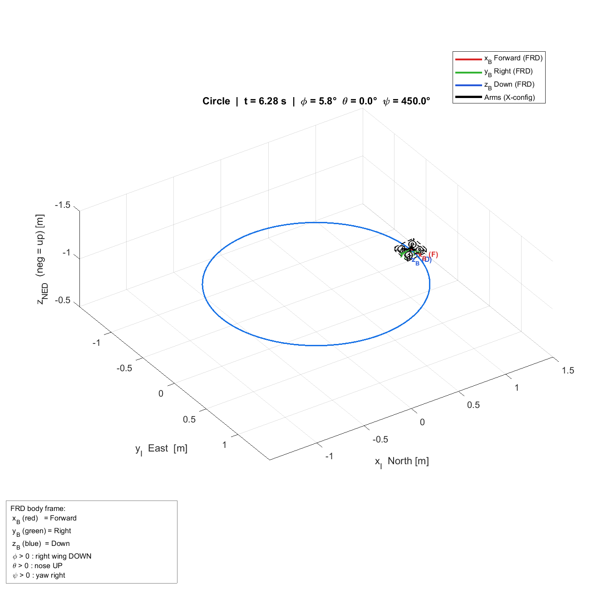
   
  <em>Visualizzazione 3D del volo in open-loop</em>

<table align="center" width="100%">
  <tr>
    <td align="center" width="50%" style="border: none;">
      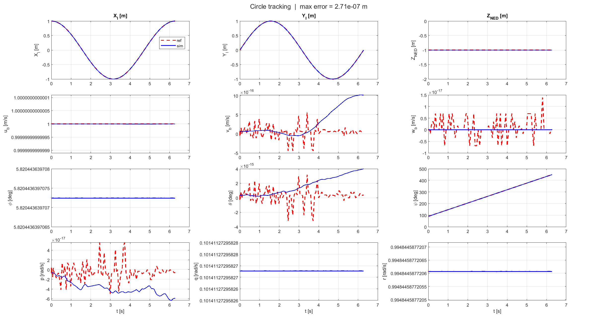
       
      <em>Evoluzione temporale degli stati</em>
    </td>
    <td align="center" width="50%" style="border: none;">
      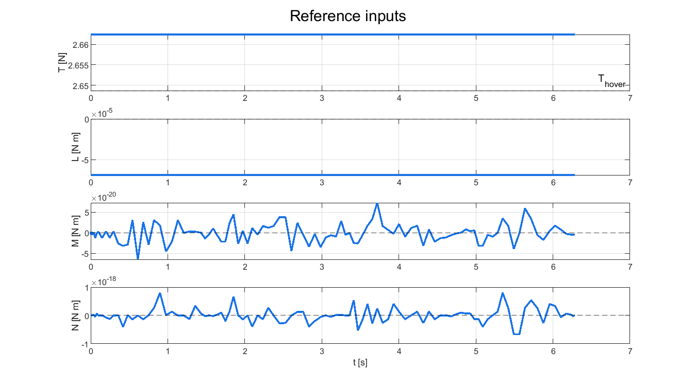
       
      <em>Input di controllo di riferimento</em>
    </td>
  </tr>
</table>

---

<h3 align="center">Open-Loop Test — Lemniscata</h3>

  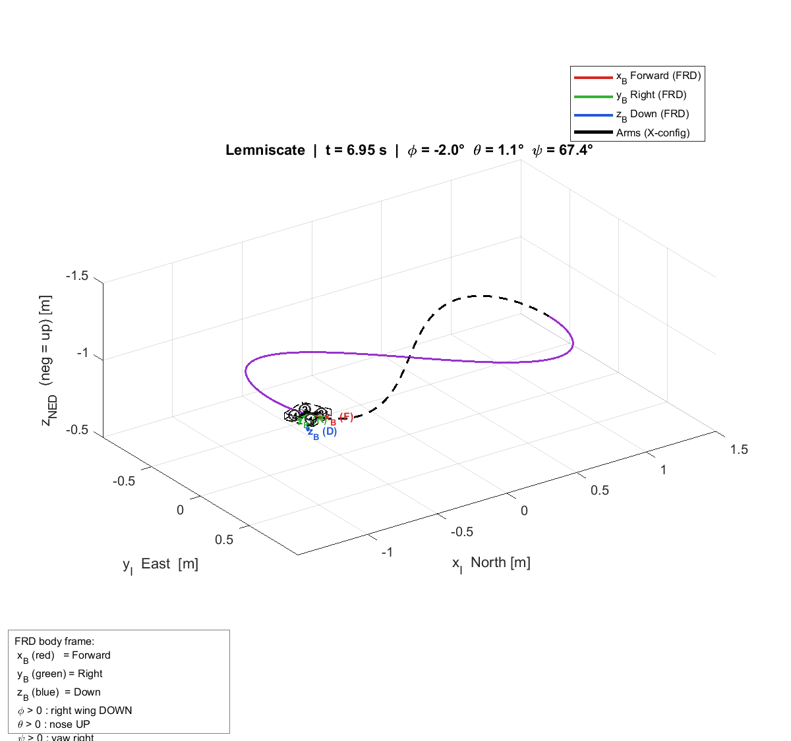
   
  <em>Visualizzazione 3D del volo in open-loop</em>

<table align="center" width="100%">
  <tr>
    <td align="center" width="50%" style="border: none;">
      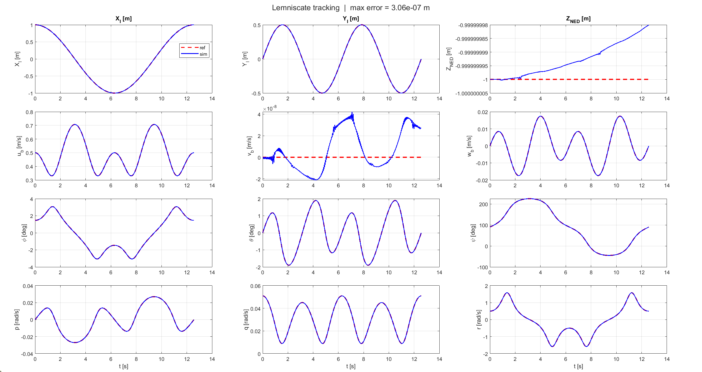
       
      <em>Evoluzione temporale degli stati</em>
    </td>
    <td align="center" width="50%" style="border: none;">
      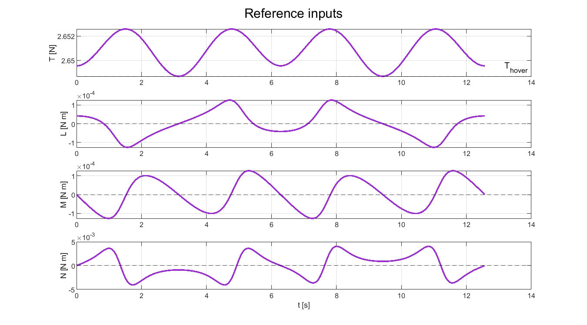
       
      <em>Input di controllo di riferimento</em>
    </td>
  </tr>
</table>

---

<h3 align="center">Open-Loop Test — Spirale</h3>

  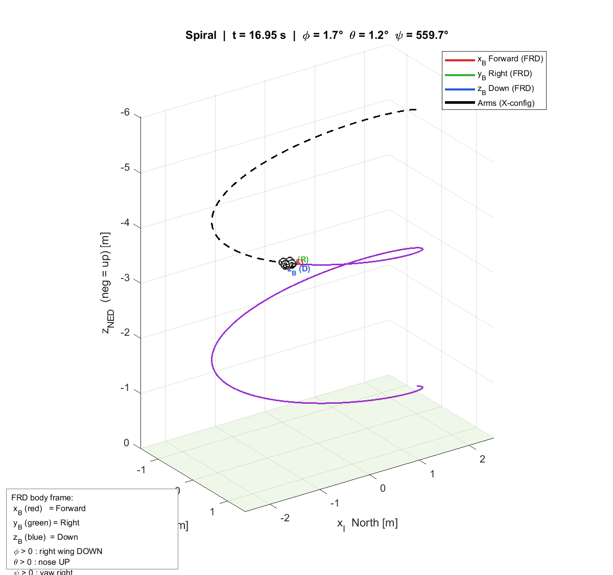
   
  <em>Visualizzazione 3D del volo in open-loop</em>

<table align="center" width="100%">
  <tr>
    <td align="center" width="50%" style="border: none;">
      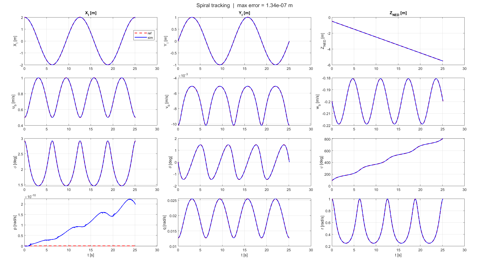
       
      <em>Evoluzione temporale degli stati</em>
    </td>
    <td align="center" width="50%" style="border: none;">
      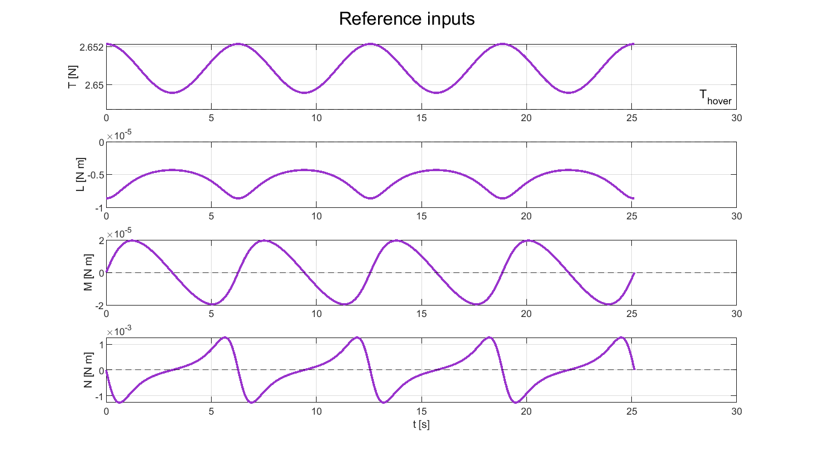
       
      <em>Input di controllo di riferimento</em>
    </td>
  </tr>
</table>

 

### Open-Loop Continuous reference vs PWC inputs generated reference

---

Questo test analizza l'effetto della discretizzazione temporale degli input sulla risposta in open-loop del sistema non-lineare, mettendo a confronto:

*   **Riferimento Continuo (linea tratteggiata nera):** La traiettoria di riferimento ideale, i cui stati e input sono calcolati analiticamente istante per istante tramite la  $\text{Flatness Map}$.
*   **Modelli a input PWC (linee colorate):** La traiettoria ottenuta integrando le equazioni dinamiche non-lineari del drone applicando in modo costante a tratti (Piece-Wise Constant) gli input campionati dalla $\text{Flatness Map}$ ad ogni sampling time $T_s$.

La traiettoria generata tramite l'integrazione con input PWC costituisce la traiettoria di riferimento effettiva che l'algoritmo MPC dovrà inseguire in closed-loop. Lo studio valuta la robustezza della traiettoria al variare del tempo di campionamento:

$$ T_s \in \{0.001 , \,\, 0.010, \,\, 0.020, \,\, 0.050\} \text{ s} $$

<table align="center" width="100%">
  <tr>
    <td align="center" width="50%" style="border: none; padding: 10px;">
      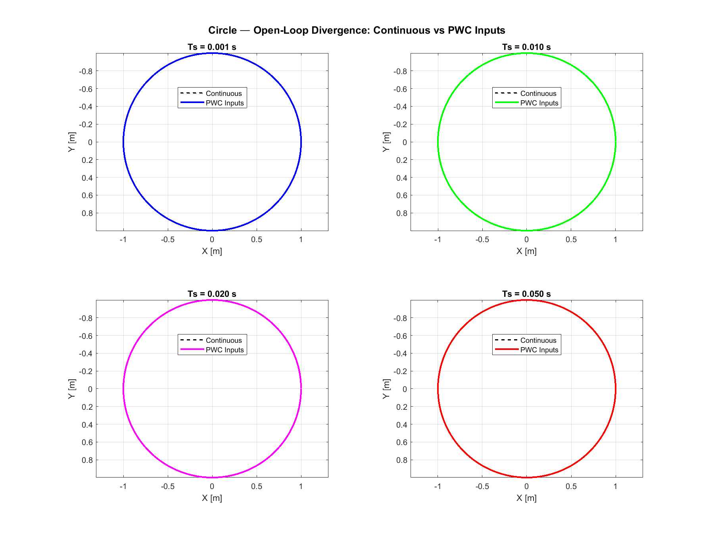
       
      <strong>Cerchio</strong>
    </td>
    <td align="center" width="50%" style="border: none; padding: 10px;">
      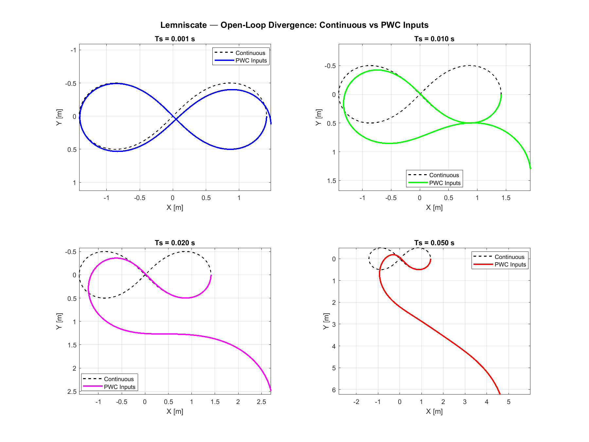
       
      <strong>Lemniscata di Bernoulli</strong>
    </td>
  </tr>
  <tr>
    <td align="center" width="50%" style="border: none; padding: 10px;">
      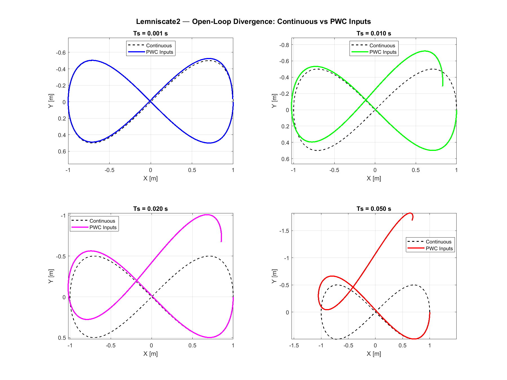
       
      <strong>Lemniscata di Gerono</strong>
    </td>
    <td align="center" width="50%" style="border: none; padding: 10px;">
      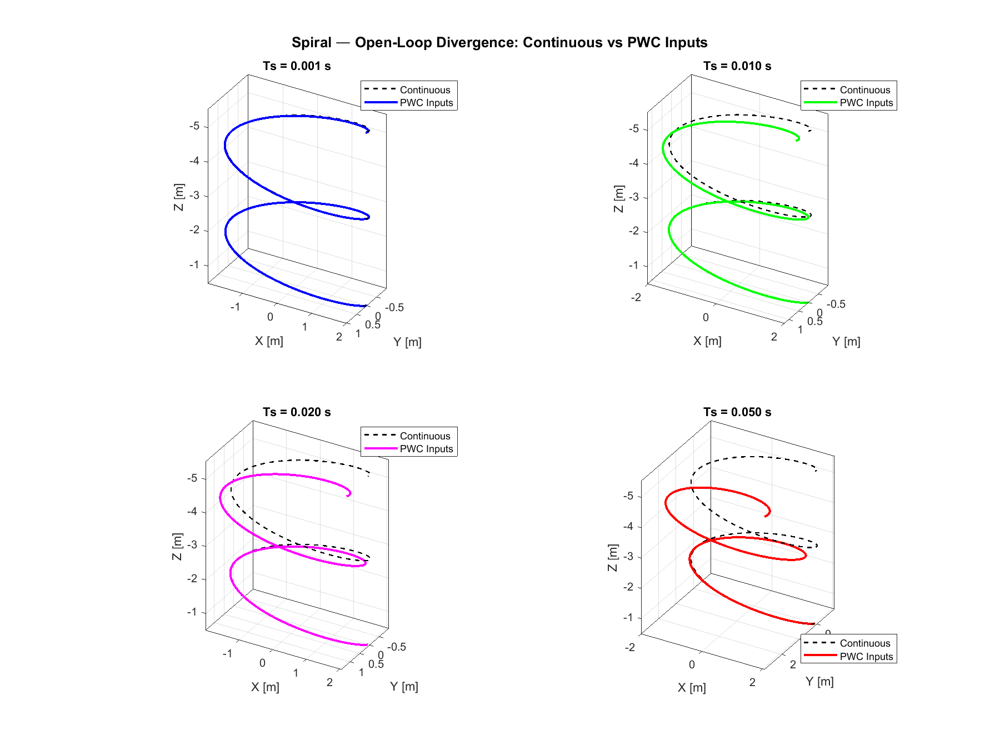
       
      <strong>Spirale</strong>
    </td>
  </tr>
  <tr>
    <td colspan="2" align="center" style="border: none; padding-top: 15px; padding-bottom: 10px;">
      

        <em>Confronto tra la traiettoria ideale continua (tratteggiata) e PWC inputs (colorata) per diversi intervalli di campionamento.</em>
      

    </td>
  </tr>
</table>

 

## Implementazione MPC

Per il tracking delle traiettorie di riferimento è stato implementato un controllore **(LTV-MPC)** basato sulla linearizzazione locale del modello non lineare del quadcopter lungo una traiettoria nominale. Ad ogni istante di campionamento viene risolto un problema di ottimizzazione quadratica (QP) su un orizzonte finito, applicando solamente il primo input ottimo secondo la strategia **Receding Horizon**.

 

### Parametri di controllo

---

Il controllore utilizza un tempo di campionamento pari a: $ T_s = 0.05 \text{s} $. In una implementazione reale, questo parametro dovrebbe tenere conto del tempo di calcolo del QP, della latenza degli ESC e della frequenza di acquisizione dei dati sullo stato.

In simulazione, il parametro $ T_s $ è modificabile per modellare ritardi e latenze fisiche del sistema reale, quali il tempo di calcolo del solutore, i tempi di risposta degli ESC o la frequenza di campionamento dell'IMU. 

L'orizzonte di predizione è impostato a $ p = 18 $.

La funzione costo quadratica utilizza le matrici diagonali:

$$
Q = Q_f =
\mathrm{diag}
\left(
50,
50,
50,
8,
8,
12,
8,
8,
10,
1,
1,
1
\right)
$$

e

$$
R =
\mathrm{diag}
\left(
2,
2,
2,
2
\right).
$$

Questi valori sono stati inizializzati seguendo la struttura riportata in [[3]](#references), assieme alla formulazione LTV-MPC adottata nel progetto.

> **Nota**: i valori di $Q$, $Q_f$ e $R$ richiedono una fase di tuning sperimentale dipendente dal modello utilizzato e dalla traiettoria di riferimento. In questa implementazione è stata assegnata una maggiore penalizzazione agli errori di posizione nel sistema di riferimento inerziale $p_I$ e all'angolo di yaw $\psi$. Una minore enfasi è stata invece attribuita alle velocità nel body frame e alle velocità angolari. La matrice $R$ è stata inizializzata in modo uniforme, assegnando lo stesso costo a tutti gli input.

I vincoli sugli stati e sugli ingressi sono introdotti direttamente all'interno del problema di ottimizzazione tramite limiti inferiori e superiori (LB e UB). In particolare, per il modello a 12 stati sono stati imposti i seguenti vincoli:

$$
-3 \leq \dot x_B,\dot y_B \leq 3 \ \text{m/s}
$$

$$
-3 \leq \dot z_B \leq 1 \ \text{m/s}
$$

$$
-35^\circ \leq \phi,\theta \leq 35^\circ
$$

$$
-600^\circ/s \leq p,q,r \leq 600^\circ/s
$$

mentre le posizioni $(x_I,y_I,z_I)$ e l'angolo di yaw $\psi$ non sono stati vincolati. Questi valori sono stati ricavati all'interno della tabella **5.3** nella tesi [[4]](#references).

> **Formulazione dei vincoli nel modello a $ 13 $ stati:**
> In questa prima analisi, i vincoli sui quaternioni $q$ sono stati **omessi** per validare la stabilità del loop di controllo ed evitare fenomeni di infattibilità numerica del solutore QP.

Per quanto riguarda gli input di controllo, sono state considerate le seguenti saturazioni come stime iniziali (da modificare e ricavare):

$$
0 \leq T \leq 2\ mg \approx 5.30 \ \text{N}
$$

$$
-0.15 \leq L,M \leq 0.15 \ \text{N m}
$$

$$
-0.05 \leq N \leq 0.05 \ \text{N m}
$$

 

### Strategia di ottimizzazione

---

Ad ogni iterazione il metodo `solve` esegue una procedura di **linearizzazione**. Per ciascun passo dell'orizzonte vengono calcolate le matrici Jacobiane del modello:

$$
A_{lin} =
\frac{\partial f}{\partial x},
\qquad
B_{lin} =
\frac{\partial f}{\partial u}
$$

linearizzate attorno alla traiettoria nominale corrente, stato misurato di $x \in \mathbb{R} ^ {12}$ o $\mathbb{R}^{13}$.

Successivamente il modello viene discretizzato mediante integrazione di Eulero e calcolando:

$$
x_{k+1} = 
A_d x_k + B_d u_k + d_k
$$

dove il termine affine

$$
d_k = x_{k+1}^{NL} - (A_d x_k + B_d u_k)
$$

compensa l'errore introdotto dalla linearizzazione locale.
 Le matrici discretizzate vengono quindi utilizzate per costruire il problema QP da risolvere ad ogni istante.

 

### Costruzione del problema QP

---

La generazione delle matrici di ottimizzazione è affidata alla classe `QPBuilder`.

Il vettore delle variabili decisionali è definito come:

$$
Z =
\begin{bmatrix}
x_0 &
u_0 &
x_1 &
u_1 &
\cdots &
u_{N-1} &
x_N
\end{bmatrix}^{T}
$$

e il problema viene formulato nella forma sparse:

$$
\min_Z

\frac{1}{2} Z^T H Z + f^T Z
$$

soggetto a:

$$
A_{eq} Z = b_{eq}
$$

e ai vincoli:

$$
lb \le Z \le ub.
$$

La matrice Hessiana $H$ è costruita come matrice blocco diagonale a partire da $Q$, $R$ e $Q_f$, mentre il termine lineare $f$ incorpora le traiettorie di riferimento degli stati e degli ingressi. I vincoli dinamici sono imposti tramite le equazioni di uguaglianza:

$$
x_{k+1}
=

A_d x_k + B_d u_k + d_k
$$

per ogni passo dell'orizzonte. L'ottimizzazione viene infine risolta tramite il solver `quadprog`.

 

### Warm Start

Una volta ottenuta la soluzione ottima, vengono estratti gli stati e gli input predetti. Solamente il primo ingresso

$$
u_0^\star \in \mathbb{R}^4
$$

viene applicato al sistema non-lineare.

La soluzione ottima viene quindi traslata di un passo e riutilizzata come nuova traiettoria nominale per l'iterazione successiva, implementando una strategia di **warm start** che riduce il numero di iterazioni richieste dal solver e migliora la continuità della soluzione lungo la simulazione.

 

## Simulazione in closed-loop

La validazione del controllore LTV-MPC è stata effettuata in `MPCSimulationLoop.m`. 

 

### Traiettorie testate

---

Il controllore MPC è stato valutato su tre traiettorie rappresentative dello spazio operativo:

* traiettoria circolare (`ShapeCircle`)
* traiettoria lemniscata (di Gerono) (`ShapeLemniscate2`)
* traiettoria spirale (`ShapeSpiral`)

Per ciascuna traiettoria viene generata offline una sequenza **piecewise constant (PWC)** di reference:

$
x_{ref}(t), \quad u_{ref}(t)
$

 mediante la funzione `GeneratePWC_reference.m`.

 

### Condizioni iniziali

---

Per ogni scenario di volo vengono testate tre differenti condizioni iniziali. 

#### 1. OnReference (Inizializzazione sulla traiettoria)

*   **Posizionamento del drone rispetto alla traiettoria:**
    Il drone viene posizionato esattamente sullo stato iniziale nominale $x_{\text{ref}}(0)$ ricavato tramite flatness map a $t = 0$. 
*   **Prima linearizzazione LTV (Stato misurato iniziale):**
    Viene eseguita utilizzando come stato misurato lo stato completo a $t=0$:
    $$ x_{0, \text{euler}} = x_{\text{ref}}(0) = [x_I(0), \,\, y_I(0), \,\, z_I(0), \,\, \dot x_B(0), \,\, \dot y_B(0), \,\, \dot z_B(0), \,\, \phi(0), \,\, \theta(0), \,\, \psi(0), \,\, p(0), \,\, q(0), \,\, r(0)]^T$$
    $$ x_{0, \text{quat}} = x_{\text{ref}}(0) = [x_I(0), \,\, y_I(0), \,\, z_I(0), \,\, \dot x_B(0), \,\, \dot y_B(0), \,\, \dot z_B(0), \,\, q_0(0), \,\, q_1(0), \,\, q_2(0), \,\, q_3(0), \,\, p(0), \,\, q_r(0), \,\, r(0)]^T$$
*   **Obiettivo:**
    Valutare la capacità del controllore di mantenere la traiettoria di volo in condizioni iniziali ideali, valutando l'impatto degli errori di discretizzazione e di linearizzazione.

 

#### 2. Perturbation (Condizione Perturbata)

*   **Posizionamento del drone rispetto alla traiettoria:**
    Il drone presenta un offset di $0.20 \text{ m}$ lungo gli assi $x$ e $y$ rispetto al punto di partenza nominale. Per isolare l'effetto dell'errore di posizione, tutte le velocità lineari nel corpo ($\dot{x}_B, \dot{y}_B, \dot{z}_B$), gli angoli di roll e pitch ($\phi, \theta$) e le velocità angolari ($p, q, r$) vengono forzati a zero. La quota $z_I$ e lo yaw $\psi$ mantengono invece il valore nominale.
*   **Prima linearizzazione LTV (Stato misurato iniziale):**
    Viene eseguita sullo stato misurato parzialmente perturbato e azzerato:
    $$ x_{0, \text{euler}} = \left[ x_{\text{ref},1}(0) + 0.20, \,\, y_{\text{ref},1}(0) - 0.20, \,\, z_{\text{ref},1}(0), \,\, 0, \,\, 0, \,\, 0, \,\, 0, \,\, 0, \,\, \psi_{\text{ref},1}(0), \,\, 0, \,\, 0, \,\, 0 \right]^T $$
    $$ x_{0, \text{quat}} = \left[ x_{\text{ref},1}(0) + 0.20, \,\, y_{\text{ref},1}(0) - 0.20, \,\, z_{\text{ref},1}(0), \,\, 0, \,\, 0, \,\, 0, \,\, \cos\left(\frac{\psi_{\text{ref},1}(0)}{2}\right), \,\, 0, \,\, 0, \,\, \sin\left(\frac{\psi_{\text{ref},1}(0)}{2}\right), \,\, 0, \,\, 0, \,\, 0 \right]^T $$
*   **Obiettivo:**
    Verificare la robustezza dell'LTV-MPC nel recuperare un errore di posizionamento iniziale, analizzando i tempi di convergenza alla reference.

 

#### 3. Origin (Decollo / Partenza dall'origine)

*   **Posizionamento del drone rispetto alla traiettoria:**
    Il drone viene posizionato al suolo. Tutte le velocità, gli angoli di assetto e le velocità angolari sono nulli. La quota $z_I$ iniziale è impostata a $-0.02 \text{ m}$, che simula l'altezza fisica da terra del baricentro del drone ($2 \text{ cm}$ nel sistema di riferimento NED, considerando $4 \text{ cm}$ di altezza del frame). 
    *   *Inizializzazione per Lemniscata:*  la posizione iniziale lungo $x_I$ viene traslata a $+0.75 \text{ m}$ per allineare il drone al di sotto del lobo destro della traiettoria.
*   **Prima linearizzazione LTV (Stato misurato iniziale):**
    Viene eseguita sullo stato misurato all'origine del frame inerziale:
    *   *Per Cerchio e Spirale:*
        $$x_{0,euler} = [0, \,\, 0, \,\, -0.02, \,\, 0, \,\, 0, \,\, 0, \,\, 0, \,\, 0, \,\, 0, \,\, 0, \,\, 0, \,\, 0]^T$$
        $$x_{0,quat} = [0, \,\, 0, \,\, -0.02, \,\, 0, \,\, 0, \,\, 0, \,\, 1, \, \,  0, \,\, 0, \,\, 0, \,\, 0, \,\, 0, \,\, 0]^T$$
    *   *Per Lemniscata:*
        $$x_{0,euler} = [0.75, \,\, 0, \,\, -0.02, \,\, 0, \,\, 0, \,\, 0, \,\, 0, \,\, 0, \,\, 0, \,\, 0, \,\, 0, \,\, 0]^T$$
        $$x_{0,quat} = [0.75, \,\, 0, \,\, -0.02, \,\, 0, \,\, 0, \,\, 0, \,\, 1, \, \, 0, \,\, 0, \,\, 0, \,\, 0, \,\, 0, \,\, 0]^T$$
*   **Obiettivo:**
    Simulare una manovra realistica di decollo o di recupero dinamico da terra verso una traiettoria già avviata in quota, sollecitando l'LTV-MPC con ampi transitori iniziali di posizione, altezza e orientamento.

 

### Metriche di valutazione

---

Le prestazioni del MPC sono valutate tramite un insieme di metriche quantitative calcolate durante la simulazione.

In particolare:

* **errore di posizione** (calcolato su $x_I, y_I, z_I$):
  $$
  e_p = |p - p_{ref}|
  $$

* **errore di assetto** (in gradi, calcolato su $\phi, \theta, \psi$):
  $$
  e_{\phi\theta\psi} = |x_{7:9} - x_{7:9}^{ref} |
  $$

* **errore sulle velocità** ($x_B$, $y_B$, $z_B$).
* **errore sui rate angolari** ($p$, $q$, $r$).

* **errore complessivo di stato**:
  $$
  e_x = |x - x_{ref}| \ s.t. \ x  \in \mathbb{R}^{12}
  $$

* **errore sugli input**:
  $$
  e_u = |u - u_{ref}|
  $$

Vengono inoltre calcolate metriche cumulative:

* **MSE / RMSE** su posizione e stato completo.
* **RMSE Steady State** in regime stazionario (una volta raggiunta la convergenza).
* tempo di convergenza basato su threshold:
  $$
  |e_p| < 0.05 \ \text{m}
  $$
* statistiche (*media* e *varianza*) del **tempo di soluzione del QP**.
* numero di istanti in cui il **budget computazionale** viene superato e threshold per 80% del budget.

 

### Output della simulazione

---

Per ogni combinazione di traiettoria e condizione iniziale vengono salvati:

* evoluzione degli stati e degli input.
* errori temporali e metriche cumulative.
* tempi di soluzione del QP.
* grafici di tracking.
* GIF della traiettoria (tracking 2D o 3D).
* file CSV con log completi della simulazione.

I risultati sono organizzati nella directory `results/` in sotto-cartelle dedicate per scenario e condizione iniziale, e raccolti in tabelle riassuntive globali per confronto tra i casi testati.

Per garantire la piena riproducibilità dei risultati, ogni run esporta in modo strutturato i seguenti file di log:

*   **Configurazione di Sistema (`simulation_config.json`):** Un file di report in formato JSON che memorizza tutti i parametri fisici del quadcopter, i vincoli e le matrici di peso dell'LTV-MPC, e i parametri geometrici delle traiettorie. Questo assicura la tracciabilità delle condizioni di simulazione.
*   **Metriche Globali (Summary e Extended):** File di riepilogo che raccolgono i dati quantitativi sull'accuratezza del tracking, sull'andamento temporale degli errori di stato/input e sulle prestazioni computazionali del risolutore QP, consentendo un debug mirato e una valutazione statistica rigorosa del sistema implementato.

 

## Risultati

In questa sezione vengono presentati i risultati della simulazione ottenuti impostando il tempo di campionamento a $ T_s = 0.05 \ \text{s} $. Le traiettorie e le condizioni iniziali proposte sono state verificate integrando il modello dinamico e il controllore MPC sviluppati, raccogliendo le metriche di valutazione precedentemente definite al fine di condurne un'analisi quantitativa.

> **Nota:** In questa sezione viene presentata solo una selezione di risultati a scopo dimostrativo. Una volta avviata la simulazione, è possibile analizzare tutti i grafici navigando all'interno della cartella di output dedicata.

 

### Tracking MPC

---

<table align="center" width="100%">
  <tr>
    <td align="center" width="50%" style="border: none; padding: 10px;">
      
       
      <em>Visualizzazione 3D del tracking sulla traiettoria circolare con condizione iniziale all'origine.</em>
    </td>
    <td align="center" width="50%" style="border: none; padding: 10px;">
      
       
      <em>Visualizzazione 2D del tracking sulla traiettoria circolare con condizione iniziale all'origine.</em>
    </td>
  </tr>
  <tr>
    <td align="center" width="50%" style="border: none; padding: 10px;">
      
       
      <em>Visualizzazione 2D del tracking sulla traiettoria lemniscata con condizione iniziale perturbata.</em>
    </td>
    <td align="center" width="50%" style="border: none; padding: 10px;">
      
       
      <em>Visualizzazione 3D del tracking sulla traiettoria spirale con condizione iniziale all'origine.</em>
    </td>
  </tr>
  <tr>
    <td colspan="2" align="center" style="border: none; padding-top: 15px; padding-bottom: 10px;">
      

        <strong>Esempio di visualizzazione GIF del tracking MPC, con diverse condizioni iniziali e su diverse traiettorie. </Strong>
      

    </td>
  </tr>
</table>

 

### Tracking dello stato

---

<table align="center" width="100%">
  <tr>
    <td align="center" width="50%" style="border: none; padding: 10px;">
      
       
      <em>Tracking dello stato - Traiettoria circolare - perturbazione</em>
    </td>
    <td align="center" width="50%" style="border: none; padding: 10px;">
      
       
      <em>Tracking dello stato - Traiettoria circolare - origine</em>
    </td>
  </tr>
  <tr>
    <td align="center" width="50%" style="border: none; padding: 10px;">
      
       
      <em>Tracking dello stato - Traiettoria lemniscata - perturbazione</em>
    </td>
    <td align="center" width="50%" style="border: none; padding: 10px;">
      
       
      <em>Tracking dello stato - Traiettoria spirale - origine</em>
    </td>
  </tr>
  <tr>
    <td colspan="2" align="center" style="border: none; padding-top: 15px; padding-bottom: 10px;">
      

        <strong>Tracciamento delle variabili di stato del drone. Confronto tra la traiettoria di riferimento  (linea rossa tratteggiata) e lo stato simulato del UAV controllato tramite MPC (linea blu).</Strong>
      

    </td>
  </tr>
</table>

 

### Analisi del Tracking 

---

<table align="center" width="100%">
  <tr>
    <td align="center" width="50%" style="border: none; padding: 10px;">
      
       
      <em>Analisi del tracking - Traiettoria circolare - perturbazione</em>
    </td>
    <td align="center" width="50%" style="border: none; padding: 10px;">
      
       
      <em>Analisi del tracking - Traiettoria circolare - origine</em>
    </td>
  </tr>
  <tr>
    <td align="center" width="50%" style="border: none; padding: 10px;">
      
       
      <em>Analisi del tracking - Traiettoria lemniscata - perturbazione</em>
    </td>
    <td align="center" width="50%" style="border: none; padding: 10px;">
      
       
      <em>Analisi del tracking - Traiettoria spirale - origine</em>
    </td>
  </tr>
  <tr>
  </tr>
</table>

**Analisi delle prestazioni di tracking in simulazione:**

* **Errore di posizione** e tempo di convergenza alla reference.
* **Errore d'assetto** (angoli di Eulero) e di imbardata (yaw).
* **RMSE cumulativo** e specifico per ogni singola variabile di stato.
* **Tempo di risoluzione** del problema QP rispetto al limite $T_s$.

 

### Tracking degli input

---

<table align="center" width="100%">
  <tr>
    <td align="center" width="50%" style="border: none; padding: 10px;">
      
       
      <em>Tracking degli input - Traiettoria circolare - perturbazione</em>
    </td>
    <td align="center" width="50%" style="border: none; padding: 10px;">
      
       
      <em>Tracking degli input - Traiettoria circolare - origine</em>
    </td>
  </tr>
  <tr>
    <td align="center" width="50%" style="border: none; padding: 10px;">
      
       
      <em>Tracking degli input - Traiettoria lemniscata - perturbazione</em>
    </td>
    <td align="center" width="50%" style="border: none; padding: 10px;">
      
       
      <em>Tracking degli input - Traiettoria spirale - origine</em>
    </td>
  </tr>
  <tr>
    <td colspan="2" align="center" style="border: none; padding-top: 15px; padding-bottom: 10px;">
      

        <strong>Tracciamento degli input del drone. Confronto tra gli input di riferimento (linea rossa tratteggiata) e gli input applicati dal MPC al drone (linea blu).</Strong>
      

    </td>
  </tr>
</table>

 

### Risultati Quantitativi 

---

#### Summary

| Condizione Iniziale | Scenario | RMSE Posizione $(m)$ | RMSE Stato Completo | RMSE Input | Tempo QP Medio $(ms)$ | Passi $(N)$ | Durata Sim. $(s)$ |
| :--- | :--- | :---: | :---: | :---: | :---: | :---: | :---: |
| **OnReference** | Circle | $5.35 \times 10^{-10}$ | $1.36 \times 10^{-8}$ | $5.82 \times 10^{-11}$ | $11.00$ | $126$ | $6.28$ |
| **OnReference** | Lemniscate | $5.63 \times 10^{-7}$  | $8.15 \times 10^{-6}$ | $1.44 \times 10^{-7}$  | $11.34$ | $252$ | $12.57$ |
| **OnReference** | Spiral | $2.51 \times 10^{-7}$  | $1.26 \times 10^{-6}$ | $2.19 \times 10^{-8}$  | $9.44$  | $503$ | $25.13$ |
| **Perturbation** | Circle | $1.48 \times 10^{-1}$  | $6.07 \times 10^{-1}$ | $1.17 \times 10^{-1}$  | $9.04$  | $126$ | $6.28$ |
| **Perturbation** | Lemniscate | $7.86 \times 10^{-2}$  | $2.79 \times 10^{-1}$ | $2.46 \times 10^{-2}$  | $8.55$  | $252$ | $12.57$ |
| **Perturbation** | Spiral | $5.57 \times 10^{-2}$  | $2.04 \times 10^{-1}$ | $3.55 \times 10^{-2}$  | $8.45$  | $503$ | $25.13$ |
| **Origin** | Circle | $3.82 \times 10^{-1}$  | $1.11 \times 10^{0}$  | $3.87 \times 10^{-1}$  | $9.10$  | $126$ | $6.28$ |
| **Origin** | Lemniscate | $1.84 \times 10^{-1}$  | $6.64 \times 10^{-1}$ | $2.44 \times 10^{-1}$  | $10.11$ | $252$ | $12.57$ |
| **Origin** | Spiral | $3.05 \times 10^{-1}$  | $7.07 \times 10^{-1}$ | $2.32 \times 10^{-1}$  | $8.88$  | $503$ | $25.13$ |

 

#### Prestazioni di Tracciamento dello Stato di posizione e completo, considerando steady-state (ss)

| Condizione Iniziale | Scenario | $\text{RMSE}_{\text{pos}}$ (all) $[m]$ | $\text{RMSE}_{\text{pos}}$ (SS) $[m]$ | $\text{RMSE}_{\text{stato}}$ (all) | $\text{RMSE}_{\text{stato}}$ (SS) | $t_{\text{conv}}$ $[s]$ |
| :--- | :--- | :---: | :---: | :---: | :---: | :---: |
| **OnReference** | Circle | $5.35 \times 10^{-10}$ | $5.35 \times 10^{-10}$ | $1.36 \times 10^{-8}$ | $1.36 \times 10^{-8}$ | $0.00$ |
| **OnReference** | Lemniscate | $5.63 \times 10^{-7}$ | $5.63 \times 10^{-7}$ | $8.15 \times 10^{-6}$ | $8.15 \times 10^{-6}$ | $0.00$ |
| **OnReference** | Spiral | $2.51 \times 10^{-7}$ | $2.51 \times 10^{-7}$ | $1.26 \times 10^{-6}$ | $1.26 \times 10^{-6}$ | $0.00$ |
| **Perturbation** | Circle | $0.1479$ | $0.0091$ | $0.6073$ | $0.0397$ | $1.50$ |
| **Perturbation** | Lemniscate | $0.0786$ | $0.0064$ | $0.2794$ | $0.0208$ | $1.35$ |
| **Perturbation** | Spiral | $0.0557$ | $0.0045$ | $0.2041$ | $0.0151$ | $1.35$ |
| **Origin** | Circle | $0.3824$ | $0.0122$ | $1.1102$ | $0.0382$ | $1.80$ |
| **Origin** | Lemniscate | $0.1839$ | $0.0080$ | $0.6644$ | $0.0190$ | $1.75$ |
| **Origin** | Spiral | $0.3046$ | $0.0049$ | $0.7069$ | $0.0258$ | $1.85$ |

 

#### Errori massimi 

| Condizione Iniziale | Scenario | Max Err. Posizione $[m]$ | Max Err. Yaw $[deg]$ | Max Err. Assetto $[deg]$ | 
| :--- | :--- | :---: | :---: | :---: | 
| **OnReference** | Circle | $8.82 \times 10^{-10}$ | $8.75 \times 10^{-7}$ | $8.79 \times 10^{-7}$ | 
| **OnReference** | Lemniscate | $1.19 \times 10^{-6}$ | $3.12 \times 10^{-4}$ | $3.13 \times 10^{-4}$ | 
| **OnReference** | Spiral | $8.18 \times 10^{-7}$ | $8.21 \times 10^{-5}$ | $8.26 \times 10^{-5}$ | 
| **Perturbation** | Circle | $0.4559$ | $3.8715$ | $23.2768$ | 
| **Perturbation** | Lemniscate | $0.3463$ | $0.9843$ | $14.4707$ | 
| **Perturbation** | Spiral | $0.3466$ | $1.4222$ | $14.0380$ | 
| **Origin** | Circle | $1.4001$ | $91.4726$ | $91.5721$ | 
| **Origin** | Lemniscate | $1.0114$ | $90.0000$ | $90.0118$ | 
| **Origin** | Spiral | $2.0568$ | $91.4232$ | $91.4913$ | 

 

#### Statistiche Computazionali del Solutore QP

| Condizione Iniziale | Scenario | QP Medio $[ms]$ | QP Peggiore $[ms]$ | Dev. Standard $[ms]$ | Passi oltre l'80% $T_s$ | 
| :--- | :--- | :---: | :---: | :---: | :---: |
| **OnReference** | Circle | $11.00$ | $37.61$ | $2.58$ | $0$ | 
| **OnReference** | Lemniscate | $11.34$ | $25.51$ | $3.61$ | $0$ | 
| **OnReference** | Spiral | $9.44$ | $24.04$ | $2.27$ | $0$ | 
| **Perturbation** | Circle | $9.04$ | $20.58$ | $1.78$ | $0$ | 
| **Perturbation** | Lemniscate | $8.55$ | $21.48$ | $1.21$ | $0$ |
| **Perturbation** | Spiral | $8.45$ | $19.78$ | $0.97$ | $0$ | 
| **Origin** | Circle | $9.10$ | $22.22$ | $2.12$ | $0$ | 
| **Origin** | Lemniscate | $10.11$ | $20.37$ | $2.40$ | $0$ | 
| **Origin** | Spiral | $8.88$ | $23.11$ | $2.02$ | $0$ | 

 

## Implementazioni Future e Conclusioni

La versione corrente costituisce una **prima validazione del processo** di simulazione LTV-MPC per il quadrotore ANT-X, e rappresenta una base di sviluppo consapevole dei propri limiti. Le criticità identificate nella sezione introduttiva comprendono:

- **Dinamica motore/ESC:** Introduzione di un delay nel modello di attuazione, per rappresentare fedelmente la latenza tra comando attuato e comando fisicamente generato.

- **Stima dello stato realistica.** Sostituzione dello stato con dati rumorosi e non sincroni provenienti dalla fusione IMU + motion capture (EKF), per replicare le condizioni operative reali del laboratorio.

- **Modello aerodinamico esteso.** Aggiornamento del modello non lineare per includere *drag traslazionale* e *rotazionale*, derivate di stabilità e di controllo ricavate da El_omari [[4]](#references).

- **Mixing e allocazione motori.** Implementazione della mappatura completa `[T, L, M, N] → [PWM₁, PWM₂, PWM₃, PWM₄]` tramite matrice di allocazione, coefficienti di spinta `C_T` e coppia `C_Q` identificati.

- **Saturazioni di input e vincoli di stato.** I limiti sugli input e sugli stati sono stime preliminari da letteratura  e richiedono verifica sperimentale. Per il modello a 13 stati (quaternione), i vincoli sulle componenti vettoriali `[q₁, q₂, q₃]` sono stati omessi.

- **Solver QP real-time.** Sostituzione di `quadprog` con un solver embeddable in grado di risolvere il problema di ottimizzazione entro i margini imposti dal tempo di campionamento `Ts`.

- **Costo terminale e stabilità.** Calcolo di `Qf` come soluzione della DARE sulla linearizzazione di hover, con
definizione di una regione terminale invariante per garantire stabilità asintotica.

- **Tuning sperimentale di `Q` e `R`.** Raffinamento sistematico dei pesi di costo sulla base dei risultati di volo, in sostituzione dei valori inizializzati da Kunz et al. [[3]](#references).

- **Identificazione sperimentale delle inerzie.** Derivazione di `Jxx`, `Jyy`, `Jzz` da misure sul drone fisico (pendolo bifilare o metodo equivalente), sostituendo i valori attualmente ereditati da Cavagini (2021) [[2]](#references).

- **Nuove traiettorie e strategie di controllo.** Estensione del set di traiettorie di reference e valutazione di varianti di controllo per migliorare la robustezza e le garanzie di stabilità in scenari più aggressivi.

- **Validazione in laboratorio.** Deployment del controllore sulla piattaforma ANT-X reale (PX4 via SLXtoPX4, Vicon/OptiTrack per la stima di posizione), seguendo un protocollo incrementale: hover → test su singoli gradi di libertà → traiettorie complesse → MPC.

 

## References

[1] ANT-X Development Team, *ANT-X Drone Platform — Software Tools Documentation*,
Politecnico di Milano, FlyART Laboratory.
Available: https://ant-x.gitlab.io/

[2] G. Cavagnini, *Identification and Control of a Nano Quadrotor*,
M.Sc. Thesis, Politecnico di Milano, Dec. 2021.
Available: https://www.politesi.polimi.it/retrieve/3ff2f2f7-e233-4e7a-8eca-f833af9bba1c/2021_12_Cavagnini.pdf

[3] L. Kunz, M. Huck, and T. H. Summers,
"Fast Model Predictive Control of Miniature Helicopters,"
in *Proc. European Control Conference (ECC)*, Zürich, Switzerland, Jul. 2013,
pp. 1377–1382.
Available: https://www.researchgate.net/publication/261435893_Fast_Model_Predictive_Control_of_miniature_helicopters

[4] S. El Omari, *Multirotor UAV Control via Dynamic Inversion*,
M.Sc. Thesis, Politecnico di Milano, A.A. 2022/2023, supervisor M. Lovera.
Available: https://www.politesi.polimi.it/handle/10589/219539

[5] D. Mellinger and V. Kumar,
"Minimum Snap Trajectory Generation and Control for Quadrotors,"
in *Proc. IEEE International Conference on Robotics and Automation (ICRA)*,
Shanghai, China, May 2011, pp. 2520–2525.
DOI: [10.1109/ICRA.2011.5980409](https://doi.org/10.1109/ICRA.2011.5980409)

[6] R. M. Murray,
*Optimization-Based Control*, Chapter: Trajectory Generation and Differential Flatness,
California Institute of Technology, Mar. 2023.
Available: http://www.cds.caltech.edu/~murray/books/AM08/pdf/obc-complete_12Mar2023.pdf

[7] M. Faessler, A. Franchi, and D. Scaramuzza,
"Differential Flatness of Quadrotor Dynamics Subject to Rotor Drag
for Accurate Tracking of High-Speed Trajectories,"
*IEEE Robotics and Automation Letters (RA-L)*, vol. 3, no. 2,
pp. 620–626, Apr. 2018.
DOI: [10.1109/LRA.2017.2776353](https://doi.org/10.1109/LRA.2017.2776353)
